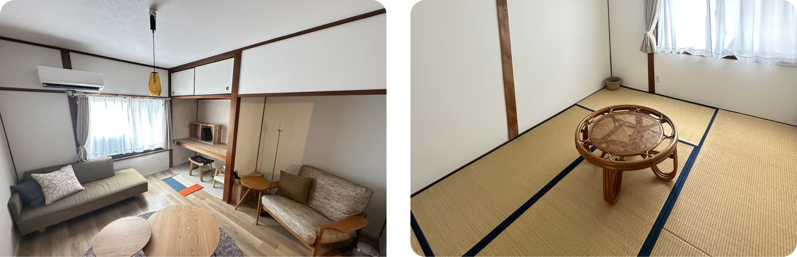
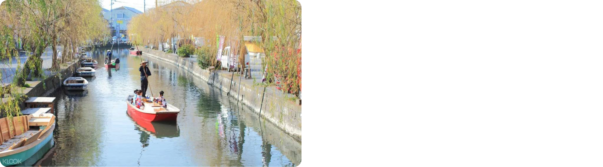
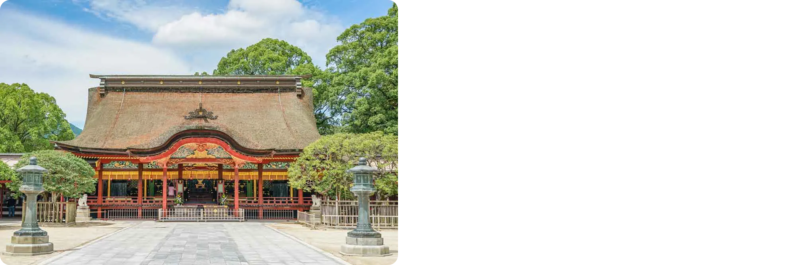
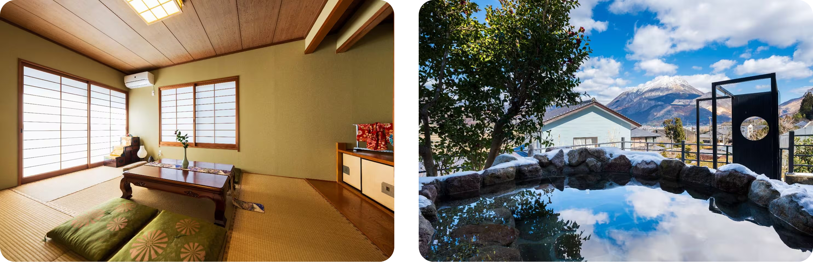
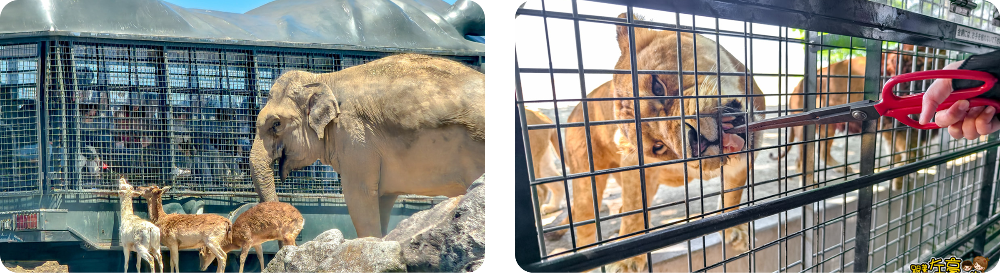
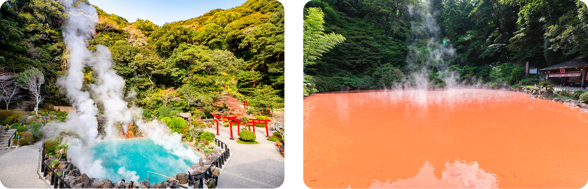
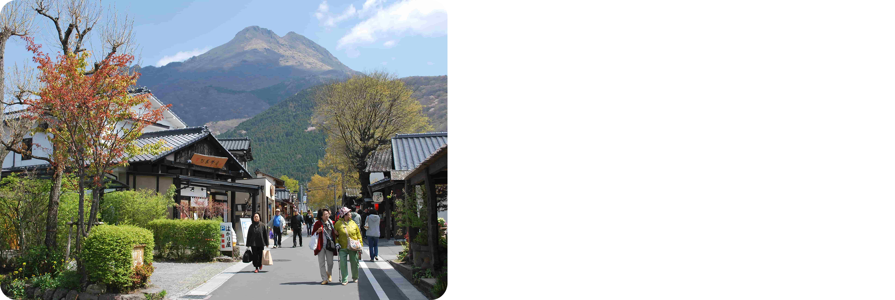
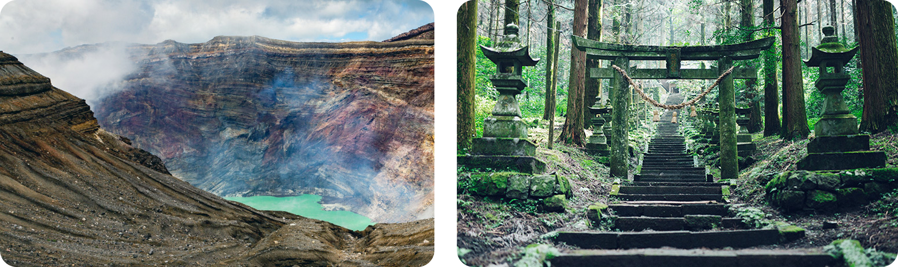

# 日本九州親子旅遊行程規劃

**旅遊日期：** 2026/2/10 - 2/17（8天7夜）
**成員：** 吳亭儀、陳思因、派皮（三大人）、吳宇在、吳宇若（兩小孩 1Y10M）
**預訂號碼：** THKI5H

## 📌 行程總覽

- [Day 1 (2/10)：抵達福岡](#day-1-210抵達福岡)
- [Day 2 (2/11)：福岡市區](#day-2-211福岡市區)
- [Day 3 (2/12)：福岡輕鬆遊（二選一）](#day-3-212福岡輕鬆遊二選一)
- [Day 4 (2/13)：福岡 → 由布院](#day-4-213福岡--由布院)
- [Day 5 (2/14)：九州自然動物公園一日遊](#day-5-214九州自然動物公園一日遊)
- [Day 6 (2/15)：別府地獄溫泉一日遊](#day-6-215別府地獄溫泉一日遊)
- [Day 7 (2/16)：由布院悠閒一日遊](#day-7-216由布院悠閒一日遊)
- [Day 8 (2/17)：由布院 → 博多站 → 福岡機場 → 台北](#day-8-217由布院--博多站--福岡機場--台北)

---
# Day 1 (2/10)：抵達福岡

### 航班資訊

| 航班 | 起飛時間 | 抵達時間 | 飛行時間 |
|------|---------|---------|---------|
| AirAsia AK 1510 | 11:55 台北桃園 (TPE) 第一航廈 | 15:15 福岡 (FUK) | 2小時20分 |

💡 **日本時間比台灣快 1 小時**，抵達福岡當地時間為 15:15（台灣時間 14:15）

### 交通

| 路線 | 交通方式 | 時間 | 費用 | Google Map |
|------|----------|------|------|------|
| 福岡機場 → 大濠公園站 | 地鐵空港線 | 約 15 分鐘 | ¥260 | [map](https://maps.app.goo.gl/DMoiuUMGzwZSpjRdA) |
| 大濠公園站 → 民宿 | 步行 | 15 分鐘 | - |  [map](https://maps.app.goo.gl/sZy5BSn4LVJBZAvJ6) |

### 行程安排

**下午**
- 抵達福岡機場
- 入境、領行李
- 搭地鐵空港線到大濠公園站
- 步行到民宿 check-in
- 大濠公園周邊散步或前往博多/天神逛街

**景點選項**
- [ ] JR 博多城（AMU PLAZA）[map](https://maps.app.goo.gl/ei5JEgKLe51dhusy7)
- [ ] 博多阪急百貨 [map](https://maps.app.goo.gl/LBNEugdPRL7J7ovE9)
- [ ] 博多站屋台村

**晚餐推薦：博多拉麵**
| 餐廳 | 位置 | 特色 |
|------|------|------|
| 一蘭拉麵 | 博多運河城或中洲店 | 經典豚骨拉麵 |
| 一風堂 | 大名本店 | 創始店 |
| 博多一幸舍 | 博多站 | 車站內方便 |

### 住宿資訊

| 📌 |  |
|------|------|
| **住宿地址** | Japan, 〒810-0075 Fukuoka, Chuo Ward, Minato, 3-chōme−3−４ 宮川運送 港 |
| **定位點** | [map](https://maps.app.goo.gl/HmpQSkupPJugUWPv5) |
| **交通位置** | 地鐵大濠公園站，步行 15 分鐘 |
| **位置優勢** | ✅ 鄰近大濠公園、福岡城跡 ✅ 前往博多站約 10 分鐘地鐵 ✅ 前往天神約 5 分鐘地鐵 |
| 設施 | 廚房、洗衣機、兩間房間 |
| 天數 | 3 晚（Day 1-3） |

---

# Day 2 (2/11)：福岡市區

💡 **福岡市區深度遊**

### 行程安排

**早上**
- 福岡城跡 [map](https://maps.app.goo.gl/Zds3J82yEcbvPq8V7)
- 大濠公園散步 [map](https://maps.app.goo.gl/vNxBjyCjiXGpehZcA)

**中午**
- 午餐自由選擇

**下午**
- 還沒排

**其他選項**
- [ ] 海之中道海濱公園 [map](https://maps.app.goo.gl/VrAiQcL2PWWM4YYM9)

---

# Day 3 (2/12)：福岡輕鬆遊（二選一）

## 方案 A：柳川一日遊

### 交通路線

| 段落 | 交通方式 | 時間 | 費用 |
|------|----------|------|------|
| 大濠公園站 → 西鐵福岡（天神）站 | 地鐵空港線 | 約5分鐘 | ¥210 |
| 西鐵福岡（天神）→ 柳川 | 西鐵天神大牟田線 | 約50分鐘 | ¥870 |

### 行程安排

**早上**
- 西鐵福岡（天神）站出發，搭乘西鐵天神大牟田線到柳川
- 抵達西鐵柳川站
- 柳川遊船（どんこ舟）體驗
  - 費用：大人 ¥1,650，小孩 ¥850
  - 冬季有暖桌被爐（こたつ舟）

**中午**
- 午餐：柳川鰻魚飯（見下方餐廳推薦）

**下午**
- 柳川老街散步（見下方景點清單）
- 搭西鐵回福岡
- 回到福岡民宿休息

### 遊船推薦

**柳川遊船（どんこ舟）**

| 公司 | 特色 |
|------|------|
| 水郷柳川観光 | 傳統遊船 |
| 大東エンタープライズ | 專業導覽 |

### 午餐推薦：柳川鰻魚飯（せいろ蒸し）

| 餐廳 | 特色 |
|------|------|
| 元祖本吉屋 | 創業 300 年老店 |
| 若松屋 | 超人氣，可能需排隊 |
| 御花 | 柳川藩主別邸，環境優美 |

### 柳川老街景點清單

- [ ] 並倉（紅磚倉庫）[map](https://maps.app.goo.gl/oYHwDa7gjKj4QU7r6)
- [ ] 柳川老街古物店、雜貨店
- [ ] 沖端水天宮 [map](https://maps.app.goo.gl/NdeYMqemDj3JvHNw9)

---

## 方案 B：太宰府半日遊

### 交通路線

| 段落 | 交通方式 | 時間 | 費用 |
|------|----------|------|------|
| 大濠公園站 → 西鐵福岡（天神）站 | 地鐵空港線 | 約5分鐘 | ¥210 |
| 西鐵福岡（天神）→ 太宰府 | 西鐵太宰府線 | 約30分鐘 | ¥420 |

### 行程安排

**早上**
- 西鐵福岡（天神）站出發，搭乘西鐵太宰府線到太宰府
- 抵達太宰府站
- 太宰府天滿宮參拜 [map](https://maps.app.goo.gl/y9ziC4mxMBkq7RhMA)
- 太宰府參道逛街（梅枝餅、伴手禮）
- 星巴克太宰府店休息（隈研吾設計）[map](https://maps.app.goo.gl/RgmxcBU6LYvZ5W1M9)

**中午**
- 午餐：太宰府當地料理

**下午**
- 回民宿休息

---

# Day 4 (2/13)：福岡 → 由布院

### 交通

| 路線 | 交通方式 | 時間 | 費用 |
|------|----------|------|------|
| 博多 → 由布院 | JR 特急ゆふいんの森 或 ゆふ | 約 2 小時 10 分 | ¥3,160/人 |

💡 **建議搭乘：** JR 特急「ゆふいんの森」（觀光列車，需預約）

📌 **抵達由布院後取租車**（租車期間：2/13 13:00 - 2/17 09:00）

### 行程安排

**早上**
- 10:00 福岡民宿退房
- 搭地鐵前往博多站
- 博多站搭乘 JR 特急ゆふいんの森

**中午**
- 抵達由布院站（約 12:30）
- 午餐：由布院當地餐廳

**下午**
- 13:00 由布院站取租車
- 1500 開車前往民宿 check-in、放行李

**下午活動選項**

| 選項 | 活動內容 | 適合對象 |
|------|----------|----------|
| **A - 輕鬆版** | 民宿休息、泡湯 | 想放鬆的家庭 |
| **B - 散步版** | 由布院溫泉街散步、金鱗湖 | 想輕鬆逛街 |

#### 住宿資訊
**由布院溫泉（4 晚，同一間民宿）**

| 📌 |    |
|------|------|
| **住宿地址** | 1118-2 Yufuinchō Kawaminami, Yufu, Oita 879-5103, Japan |
| **定位點** | [map](https://maps.app.goo.gl/MvbmRoaPAoWYpXqTA) |
| **位置優勢** | ✅ 距由布院 JR 站 2 公里，開車 5 分鐘，步行 24 分鐘 ✅ 入住和退房提供免費【由布院 JR 車站】接送 |
| **必備設施** | ✅ 停車場 |
| **住宿天數** | 4 晚（Day 4-7） |
| **備註** | 小景綠在湯布院町川南 1118-2 |

---

# Day 5 (2/14)：九州自然動物公園一日遊

### 交通資訊

| 路線 | 交通方式 | 距離 | 車程 |
|------|----------|------|------|
| 由布院民宿 → 九州自然動物公園 | 開車 | 約 22 公里 | 約 30-35 分鐘 |

[map](https://maps.app.goo.gl/beB1nUjMLpzR885K6)

### 行程安排

**早上**
- 從民宿開車出發前往九州自然動物公園
- 抵達動物園，購票、準備

**中午**
- 野生動物區巴士遊覽（不含餵食）
  - 費用：大人 ¥2,600（門票含一般巴士）
  - 小孩（4歲以下）免費
  - 可近距離觀賞獅子、老虎、熊等猛獸
- 午餐：園內餐廳或自備便當

**下午**
- 互動動物區（小孩可餵食小動物、騎馬）
- 開車回由布院民宿

### 九州自然動物公園資訊

| 項目 | 詳細 |
|------|------|
| **正式名稱** | 九州自然動物公園 アフリカンサファリ |
| **營業時間** | 09:00-16:30（最後入園 15:30） |
| **停車場** | 免費 |
| **門票** | 大人 ¥2,600 小孩（4歲～小學生）¥1,500 4歲以下免費 |

💡 **已選擇：一般巴士遊覽**
- **費用**：門票已含，無需額外付費
- **特色**：可以近距離觀賞獅子、老虎、熊等猛獸
- **注意**：一般巴士通常不需預約，現場購票即可

✅ **特色：**
- 日本最大野生動物園之一
- 可近距離觀察獅子、老虎、大象、長頸鹿等 70 多種動物
- 小孩可以餵食小動物（兔子、天竺鼠等）

### 園內活動推薦

| 活動 | 費用 | 適合對象 | 備註 |
|------|------|----------|------|
| ✅ 一般巴士遊覽 | 門票已含 | 全家 | **已選擇**，近距離觀賞動物 |
| 小動物互動區 | 免費 | 小孩 | 可餵食、撫摸 |

### ⚠️ 注意事項

| 項目 | 說明 |
|------|------|
| **建議停留時間** | 3-4 小時 |
| **天氣** | 冬天可能較冷，建議穿暖 |
| **購票方式** | 現場購票即可，無需預約 |

---

# Day 6 (2/15)：別府地獄溫泉一日遊

### 交通資訊

| 路線 | 交通方式 | 距離 | 車程 |
|------|----------|------|------|
| 由布院 → 別府鐵輪溫泉區 | 開車（県道11号 → 県道52号） | 約 25 公里 | 約 35-40 分鐘 |

💡 **鐵輪（かんなわ）** 是別府市的溫泉區，大部分地獄溫泉都集中在此區域

### 行程安排

**早上**
- 從由布院民宿開車出發
- 抵達別府鐵輪地獄溫泉區
- 別府地獄溫泉巡禮（開車移動於各地獄間）

**中午**
- 午餐：別府當地料理

**下午**
- 開車回由布院民宿
- 民宿休息、泡溫泉

### 別府地獄溫泉巡禮

**門票選擇：**

| 方案 | 內容 | 費用 | 適合對象 |
|------|------|------|----------|
| **推薦方案** | 3-4 個地獄 | ¥1,800 | 帶小孩，不想太累 |
| 通票方案 | 7 個地獄通票 | ¥2,200 | 想多看幾個 |

**推薦組合（3-4個，共 ¥1,800）：**

**海地獄**

- [ ] ¥450 - 鈷藍色，最美，必看

**かまど地獄**
- [ ] ¥450 - 灶地獄，6 種地獄一次看，CP 值超高

**血池地獄 + 龍捲地獄**

- [ ] ¥900 組合票 - 紅色地獄 + 間歇泉，兩個在一起

**所有地獄清單（供參考）：**

| # | 地獄名稱 | 特色 | 推薦度 | 單獨門票 |
|---|----------|------|--------|----------|
| 1 | 海地獄 | 鈷藍色，最美 | ⭐⭐⭐⭐⭐ | ¥450 |
| 2 | 鬼石坊主地獄 | 灰色泥漿 | ⭐⭐⭐⭐ | ¥450 |
| 3 | 山地獄 | 河馬、紅鶴 | ⭐⭐⭐⭐ | ¥450 |
| 4 | かまど地獄 | 灶地獄，6 種地獄 | ⭐⭐⭐⭐⭐ | ¥450 |
| 5 | 鬼山地獄 | 鱷魚地獄 | ⭐⭐⭐ | ¥450 |
| 6 | 白池地獄 | 青白色 | ⭐⭐⭐ | ¥450 |
| 7 | 血池地獄 | 紅色 | ⭐⭐⭐⭐ | 組合票 ¥900 |
| 8 | 龍捲地獄 | 間歇泉，每 30-40 分鐘噴發 | ⭐⭐⭐⭐ | 組合票 ¥900 |

### 午餐推薦：別府當地料理

| 餐廳 | 特色 | 推薦菜色 |
|------|------|----------|
| とよ常本店 | 新鮮海鮮 | 關サバ、關アジ |
| 地獄蒸し工房 鉄輪 | 用地獄蒸氣蒸食物 | 地獄蒸し定食 |
| 甘味茶屋 | 溫泉甜點 | 地獄蒸しプリン（溫泉布丁） |

---

# Day 7 (2/16)：由布院悠閒一日遊

### 行程安排

**早上**
- 民宿睡到自然醒（前幾天都早起，今天放鬆）
- 開車前往金鱗湖晨間散步
- 回民宿或咖啡廳休息

**中午**
- 開車前往湯之坪街道逛街購物
- 午餐：由布院特色餐廳

**下午**
- 車站周邊逛逛
- 開車回民宿休息、泡溫泉
- 民宿晚餐（最後一晚溫泉）

### 金鱗湖

**金鱗湖**

✅ **特色：**
- 早上霧氣最美
- 湖邊散步、拍照
- 開車前往，有停車場

### 湯之坪街

| 店家 | 類型 | 備註 |
|------|------|------|
| B-speak | 蛋糕店 | 蛋糕捲，記得早點去！ |
| Yufuin Floral Village | 歐風小村 | 拍照好看 |
| Snoopy 茶屋 | 主題咖啡廳 | 小孩會喜歡 |
| Donguri no Mori | 宮崎駿專賣店 | 龍貓周邊 |
| 由布院駅舎温泉 | 足湯 | 車站旁，免費 |
| 古物店、雜貨店 | 特色小店 | 可慢慢逛 |

### 午餐推薦：由布院特色餐廳

| 餐廳 | 特色 | 推薦菜色 |
|------|------|----------|
| 由布まぶし心 | 鰻魚飯專門店 | 鰻魚飯三吃 |
| 茶房 天井棧敷 | 隱密咖啡廳 | 午間套餐 |
| Bistro Shou | 景觀餐廳 | 洋食套餐 |

---

# Day 8 (2/17)：由布院 → 博多站 → 福岡機場 → 台北

### 航班資訊

| 航班 | 起飛時間 | 抵達時間 | 飛行時間 |
|------|---------|---------|---------|
| AirAsia AK 1511 | 17:00 福岡 (FUK) | 18:30 台北桃園 (TPE) 第一航廈 | 2小時30分 |

💡 **台灣時間比日本慢 1 小時**，抵達台北當地時間為 18:30（日本時間 19:30）

### 交通
- 由布院 → 博多：JR 特急ゆふいんの森 或 ゆふ，約 2 小時 10 分，¥3,160
- 博多 → 福岡機場：地鐵空港線，5 分鐘，¥260

### 詳細時間表

| 時間 | 活動 | 備註 |
|------|------|------|
| 07:30 | 民宿早餐 | - |
| 08:30 | 整理行李、準備退房 | - |
| 09:00 | 民宿退房（建議時間，最晚 10:00） | - |
| 09:10 | 由布院站還車 | 租車公司 |
| 09:24 | 由布院站搭 JR 特急「ゆふ 6 號」 | 需預約指定席 |
| 11:36 | 抵達博多站 | - |
| 11:40-13:30 | 博多站採買伴手禮、午餐 | 約 2 小時 |
| 13:30 | 搭地鐵空港線前往福岡機場 | 約 5 分鐘 |
| 13:40 | 抵達福岡機場國際航廈 | - |
| 13:40-16:30 | 辦理登機、托運行李、逛免稅店 | 建議 14:30 前完成報到 |
| 17:00 | 福岡機場起飛 | AirAsia AK 1511 |
| 18:30 | 抵達台北桃園機場第一航廈 | 台灣時間 |

💡 **建議搭乘 09:24 的「ゆふ 6 號」**，留充足時間在博多站採買和用餐

### 伴手禮推薦
**博多駅マイング（MING）（車站地下街）**
- 福太郎（明太子）
- 博多通りもん（銘菓）
- めんべい（仙貝）

**博多阪急百貨 B1**
- 各種福岡銘菓
- 明太子專賣區

**デイトス（DEITOS）（車站內）**
- 一蘭泡麵
- 一風堂泡麵

### 午餐推薦
- 博多駅ラーメン街（拉麵一條街，10 樓）
- 博多阪急餐廳樓層（11-13 樓）
- つきひ（站內和食）

---

### 住宿總結
- **福岡市區：** 3 晚（Day 1-3）
  - 地址：Japan, 〒810-0075 Fukuoka, Chuo Ward, Minato, 3-chōme−3−４ 宮川運送 港
  - 交通位置：大濠公園站，走路 15 分鐘
  - 已支付：NT$ 11,589
- **由布院溫泉：** 4 晚（同一間民宿，Day 4-7）
  - 地址：1118-2 Yufuinchō Kawaminami, Yufu, Oita 879-5103, Japan
  - 位置優勢：距由布院 JR 站 2 公里，開車 5 分鐘，步行 24 分鐘
  - 特色：入住和退房提供免費【由布院 JR 車站】接送

### 租車總結
- **租車期間：** Day 4-8（2/13 13:00 - 2/17 09:00，約 3.5 天）
- **取車：** Day 4（2/13）13:00，由布院站
- **還車：** Day 8（2/17）09:00，由布院站
- **車型：** 7人座或8人座（可容納 4 大人 + 2 小孩）
- **必備：** 嬰兒座椅 x2（2 位小孩使用）
- **雪胎：** 視天氣決定（租車時確認能否臨時加購）

#### 預估費用
- 租車 3.5 天（7-8人座）：¥60,000-70,000（NT$ 13,200-15,400）
- 油費：¥4,500（NT$ 990）
- 過路費：¥0（都是一般道路）
- **總計：約 NT$ 14,190-16,390**

---

### 預算總結

#### 已確定費用
| 項目 | 費用（2 大人 + 2 小孩） | 備註 |
|------|---------------------------|------|
| **✅ 機票** | NT$ 37,680 | 預訂號碼：THKI5H（已付 2 大人 + 2 小孩） |
| **✅ 由布院住宿 4 晚** | NT$ 26,835 | Tin 已支付（1118-2 Yufuinchō Kawaminami） |
| **✅ 福岡住宿 3 晚** | NT$ 11,589 | Tin 已支付（〒810-0075 Fukuoka, Chuo Ward, Minato, 3-chōme−3−４） |
| **小計** | NT$ 76,104 | 機票 + 住宿 |

---

### 重要提醒

#### 出發前必辦事項
- ✅ **機票**：已訂！AirAsia 2026/2/10-2/17（預訂號碼：THKI5H）
- ✅ **由布院住宿**：已訂！1118-2 Yufuinchō Kawaminami（4 晚，提供免費 JR 站接送）
- ✅ **福岡住宿**：已訂！〒810-0075 Fukuoka, Chuo Ward, Minato, 3-chōme−3−４（3 晚，已支付 NT$ 11,589）
- ⚠️ **小孩護照**：2 位小孩（1Y10M）都需要辦護照
  - 需準備：戶口名簿、照片 2 張、父母雙方身分證
  - 規費：NT$ 900/人（未滿 14 歲）
  - 工作天：5 個工作天
  - 效期：5 年
  - 💡 建議找有幫嬰幼兒拍證件照經驗的照相館
- ⚠️ **駕照譯本**：去監理站申請（NT$ 100）
  - 需本人攜帶：身分證、駕照、護照
- ⚠️ **租車**：提早訂，確認由布院站有取還車點
  - 租車期間：Day 4-8（2/13 13:00 - 2/17 09:00，約 3.5 天）
  - 取車：Day 4（2/13）13:00 由布院站
  - 還車：Day 8（2/17）09:00 由布院站
  - 車型：7人座或8人座（可容納 4 大人 + 2 小孩）
  - 記得加租：嬰兒座椅 x2（2 位小孩使用）
  - **詢問：如果臨時需要雪胎，能否加購？**（視天氣決定）
- ⚠️ **JR 預約**：「ゆふいんの森」觀光列車建議提早預約（Day 4 & Day 8）
  - 可透過 JR 九州網站或到站後劃位

#### 出發前確認
- ⚠️ **天氣**：查詢九州天氣預報
  - [日本氣象廳](https://www.jma.go.jp/)
  - [日本道路交通情報](https://www.jartic.or.jp/)
- ✅ **保持彈性**：天氣不好就調整行程

---

## 備選行程：阿蘇火山一日遊（如果有精力）

💡 **適合時機：** Day 5 或 Day 6 若精力充沛，可考慮前往阿蘇火山

### 路線資訊

| 項目 | 詳細 |
|------|------|
| **路線** | 由布院 → やまなみハイウェイ（九州橫斷公路）→ 阿蘇 |
| **距離** | 約 60 公里 |
| **車程** | 單程 1-1.5 小時 |

### 詳細時間表

| 時間 | 地點/活動 | 費用 | 備註 |
|------|----------|------|------|
| 08:00 | 由布院民宿出發 | - | 帶便當或飯糰 |
| 08:20-08:40 | 長者原休息站 | - | やまなみハイウェイ中點，風景很美 |
| 09:00-09:30 | 抵達阿蘇 | - | - |
| 09:30-11:00 | 阿蘇火山口 | 停車 ¥500 門票 ¥500 | ⚠️ 山上很冷，要穿暖 |
| 11:00-11:30 | 草千里 | - | 廣闊草原，拍照絕美 |
| 11:30-12:30 | 午餐：阿蘇赤牛料理 | - | 見下方餐廳推薦 |
| 12:30-14:00 | 阿蘇神社 | - | 參拜、參道商店街 |
| 14:30 | 開始回程 | - | - |
| 16:00 | 回到由布院 | - | - |

### 阿蘇火山口資訊

| 項目 | 詳細 |
|------|------|
| **正式名稱** | 阿蘇中岳火山口 |
| **停車場** | 阿蘇山上廣場駐車場（¥500） |
| **門票** | ¥500（火山活動狀況允許才開放） |
| **交通方式** | 可搭纜車或走上去（約 10 分鐘） |
| **Google Maps** | [阿蘇火山口停車場](https://maps.app.goo.gl/99hAHctbbYdUriiY6) |

⚠️ **重要提醒：**
- 行前確認開放狀況：[阿蘇火山防災協議會](http://www.aso.ne.jp/~volcano/)
- **山上很冷，務必穿暖！**
  - 2月山上溫度：約 **-5°C 到 5°C**
  - 加上風寒效應會更冷
  - 建議穿著：羽絨外套、毛帽、手套、圍巾
  - 很可能有雪，注意防滑

**阿蘇中岳火山口**

📍 **Google Maps：** [阿蘇火山口停車場](https://maps.app.goo.gl/99hAHctbbYdUriiY6)

**草千里**

📍 **Google Maps：** [阿蘇草千里之濱](https://maps.app.goo.gl/YrJwnDWvW1av2vdEA)

✅ **特色：**
- 就在火山口附近，開車 5 分鐘
- 廣闊草原，可能有雪
- 小孩可以跑跳
- 拍照絕美

### 午餐推薦：阿蘇赤牛料理

| 餐廳 | 特色 | 推薦菜色 | 備註 |
|------|------|----------|------|
| いまきん食堂 | 超人氣 | 赤牛丼 | 可能要排隊 |
| あか牛の館 | 景觀餐廳 | 赤牛定食 | 草千里旁 |
| レストラン北山 | 高級餐廳 | 赤牛ステーキ | 價位較高 |

### 下午景點：阿蘇神社

✅ **特色：**
- 日本重要神社，2016 年地震後重建
- 參道有商店街，可以逛逛
- 停留時間：1-1.5小時

### ⚠️ 注意事項

| 項目 | 說明 |
|------|------|
| **雪胎** | 冬季山路可能有雪，務必租雪胎 |
| **天氣** | 行前查天氣和路況：[日本道路交通情報](https://www.jartic.or.jp/) |
| **備案** | 如果路況不佳，彈性取消改在別府或由布院玩 |
| **體力** | 這是額外行程，若帶小孩覺得累可以跳過 |
