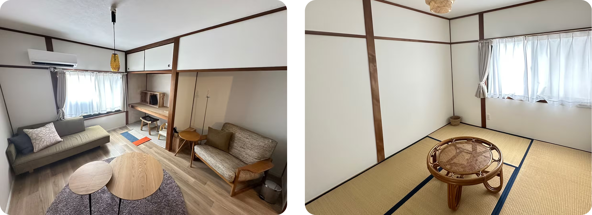
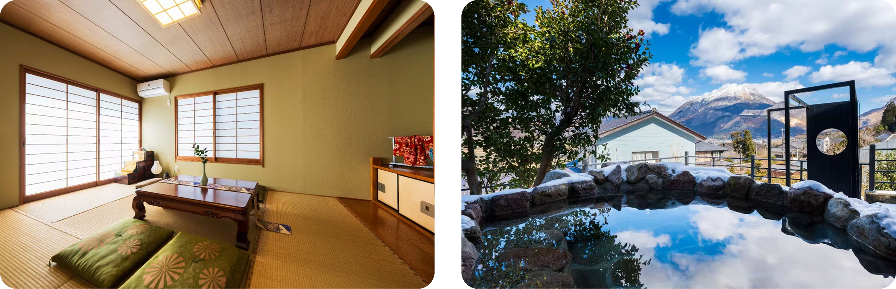
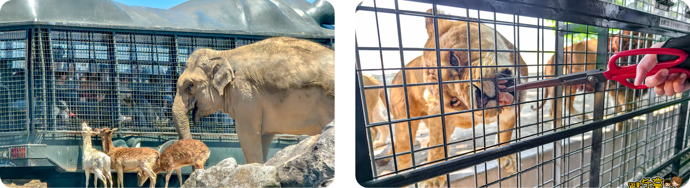
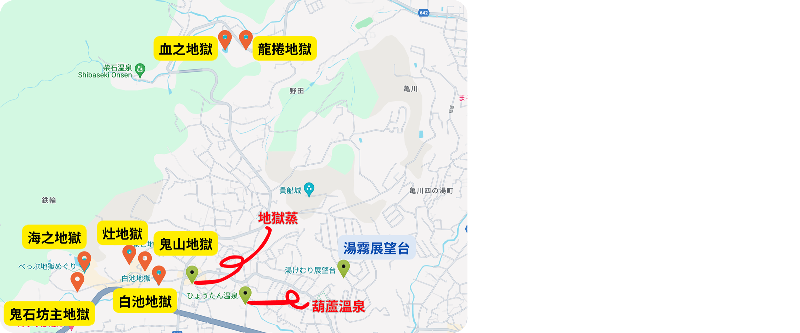

# 日本九州年假旅遊行程

**旅遊日期：** 2026/2/10 - 2/17（8天7夜）

**成員：** 吳亭儀、陳思因、派皮、夏啟揚（四大人）、吳宇在、吳宇若（兩小孩 1Y10M）

## 行前準備

- 🧳 [行李清單](packing-list.md)
- 🚗 [租車資訊](rental-car-v2.md)
- ✈️ [機票](Itinerary_TPE_FUK_10-02-2026_41521172815.pdf)

## 行程總覽

- [Day 1 (2/10)：抵達福岡](#day-1-210抵達福岡)
- [Day 2 (2/11)：太宰府半日遊](#day-2-211太宰府半日遊)
- [Day 3 (2/12)：柳川一日遊](#day-3-212柳川一日遊)
- [Day 4 (2/13)：福岡 → 由布院](#day-4-213福岡--由布院)
- [Day 5 (2/14)：由布院悠閒一日遊](#day-5-214由布院悠閒一日遊)
- [Day 6 (2/15)：九州自然動物公園一日遊](#day-6-215九州自然動物公園一日遊)
- [Day 7 (2/16)：別府地獄溫泉一日遊](#day-7-216別府地獄溫泉一日遊)
- [Day 8 (2/17)：由布院 → 博多站 → 福岡機場 → 台北](#day-8-217由布院--博多站--福岡機場--台北)

---

備註：台灣農曆過年年假為：🧧 2/14（六）- 2/22（日）此行程要請假 10-13 四天。

# Day 1 (2/10)：抵達福岡

📌 2/9 搭 **17:46-21:48 台東-板橋**的火車，先在中和住一晚。2/10 上午 09:00 出發前往機場。

### 航班資訊

| 航班 | 起飛時間 | 抵達時間 | 飛行時間 |
|------|---------|---------|---------|
| AirAsia AK 1510 | 11:55 台北桃園 (TPE) 第一航廈 | 15:15 福岡 (FUK) | 2小時20分 |

💡 **日本時間比台灣快 1 小時**，抵達福岡當地時間為 15:15（台灣時間 14:15）

### 交通

**地鐵套票建議**

💡 **推薦方案：單程票即可（最省錢）**

根據行程分析，買**單程票**最划算：
- Day 1：福岡機場 → 大濠公園 (¥260)
- Day 2：大濠公園 ↔ 天神 (¥420) + 天神 ↔ 太宰府 (¥840) = ¥1,260
- Day 3：大濠公園 ↔ 天神 (¥420) + 天神 ↔ 柳川 (¥1,740) = ¥2,160
- **3天總計：¥3,680 / 大人**

**其他套票選項（供參考）：**

| 套票 | 價格 | 適用範圍 | 建議 |
|------|------|----------|------|
| 福岡市地下鐵一日券 | ¥640 / 日 | 福岡市地鐵全線 | 不適合，西鐵不能用 |
| FUKUOKA TOURIST CITY PASS | ¥1,340 / 日 | 地鐵+西鐵巴士 | 不含西鐵電車，不適合 |

⚠️ **注意：**太宰府和柳川需搭乘「西鐵電車」，不是地鐵，所以地鐵套票無法使用。

**購票地點：**
- 福岡機場地鐵站售票機（接受現金、信用卡）
- 可使用 IC 卡（ICOCA、Suica、PASMO 等）

| 路線 | 交通方式 | 時間 | 費用 | Google Map |
|------|----------|------|------|------|
| 福岡機場 → 大濠公園站 | 地鐵空港線 | 約 15 分鐘 | ¥260 | [map](https://maps.app.goo.gl/DMoiuUMGzwZSpjRdA) |
| 大濠公園站 → 民宿 | 步行 | 15 分鐘 | - |  [map](https://maps.app.goo.gl/sZy5BSn4LVJBZAvJ6) |

### 購物項目
TODO:
查住宿附近的麵包店、超市
- 尿布
- 牛奶
- 奶粉？
- 買水果、雞蛋
- 吐司、麵包
- 便當
- 抹茶粉
- 三鐵防寒衣？

### 行程安排

**下午**
- 抵達福岡機場
- 入境、領行李
- 搭地鐵空港線到大濠公園站
- 步行到民宿 check-in

**景點選項**
- [ ] 福岡麵包超人兒童博物館 [map](https://maps.app.goo.gl/CevXrmKaccU3kFAYA)
- [ ] 博多站屋台村（晚餐）

**民宿晚餐推薦**

附近的超市有很多日常用品♪ [map](https://maps.app.goo.gl/qGytKWrS2zutaevSA?g_st=ipc)

一些餐廳 ^^

餐廳 1: 義大利麵漢堡排 [map](https://maps.app.goo.gl/CEW5ddDBDoGrT19k8?g_st=ipc)

餐廳 2: 日式海鮮 [map](https://maps.app.goo.gl/Ak36foKiZNnAPnDWA?g_st=ipc)

雖然不是很大的藥店，但有各種尺寸的嬰兒尿布 [map](https://maps.app.goo.gl/EH2EBDBbTGJW79Ni9?g_st=ipc)

### 住宿資訊

[airbnb 房源](https://www.airbnb.com.tw/rooms/1495891252539833536?source_impression_id=p3_1762420851_P3Bgs3fa_6VXARKe)

| 📌 |  |
|------|------|
| **住宿地址** | Japan, 〒810-0075 Fukuoka, Chuo Ward, Minato, 3-chōme−3−４ 宮川運送 港 |
| **定位點** | [map](https://maps.app.goo.gl/HmpQSkupPJugUWPv5) |
| **交通位置** | 地鐵大濠公園站，步行 15 分鐘 |
| **位置優勢** | 前往博多站約 10 分鐘地鐵 前往天神約 5 分鐘地鐵 |
| 設施 | 廚房、洗衣機、兩間房間 |
| 天數 | 3 晚（Day 1-3） |

---

# Day 2 (2/11)：太宰府半日遊

**交通路線**

| 段落 | 交通方式 | 時間 | 費用 |
|------|----------|------|------|
| 大濠公園站 → 西鐵福岡（天神）站 | 地鐵空港線 | 約5分鐘 | ¥210 |
| 西鐵福岡（天神）→ 太宰府 | 西鐵太宰府線 | 約30分鐘 | ¥420 |

太宰府天滿宮 [map](https://maps.app.goo.gl/y9ziC4mxMBkq7RhMA)

**行程安排**

- 西鐵福岡（天神）站出發，搭乘西鐵太宰府線到太宰府
- 抵達太宰府站
- 太宰府天滿宮參拜
- 太宰府參道逛街（梅枝餅、伴手禮）
- 星巴克太宰府店休息（隈研吾設計）[map](https://maps.app.goo.gl/RgmxcBU6LYvZ5W1M9)
- [ ] 九州國立博物館 [map](https://maps.app.goo.gl/V3ixxeY28xn1c8VT6)

午餐參考1：福岡 Hotel Il Palazzo 飯店  ホテル イル・パラッツォ 
Semi-Buffet Lunch 11:30-15:00(L.O14:30) 3,500円（700NTD）  
[官網連結](https://ilpalazzo.jp/en/lounge)  [map](https://maps.app.goo.gl/vBu67m7uNT41pBcCA)

**其他景點選項**
- 舊福岡縣公會堂貴賓館 [map](https://maps.app.goo.gl/Y2ETef66ordeJzMU9)
- 福岡城跡 [map](https://maps.app.goo.gl/Zds3J82yEcbvPq8V7)
- 大濠公園散步 [map](https://maps.app.goo.gl/vNxBjyCjiXGpehZcA)

---

# Day 3 (2/12)：柳川一日遊

### 交通路線

| 段落 | 交通方式 | 時間 | 費用 |
|------|----------|------|------|
| 大濠公園站 → 西鐵福岡（天神）站 | 地鐵空港線 | 約5分鐘 | ¥210 |
| 西鐵福岡（天神）→ 柳川 | 西鐵天神大牟田線 | 約50分鐘 | ¥870 |

### 行程安排

**早上**
- 西鐵福岡（天神）站出發，搭乘西鐵天神大牟田線到柳川
- 抵達西鐵柳川站
- 柳川遊船（どんこ舟）體驗
  - 費用：大人 ¥1,650，小孩 ¥850
  - 冬季有暖桌被爐（こたつ舟）

**中午**
- 午餐：柳川鰻魚飯（見下方餐廳推薦）

**下午**
- 柳川老街散步（見下方景點清單）
- 搭西鐵回福岡
- 回到福岡民宿休息

### 遊船推薦

**柳川遊船（どんこ舟）**

| 公司 | 特色 |
|------|------|
| 水郷柳川観光 | 傳統遊船 |
| 大東エンタープライズ | 專業導覽 |

### 午餐推薦：柳川鰻魚飯（せいろ蒸し）

| 餐廳 | 特色 |
|------|------|
| 元祖本吉屋 [map](https://maps.app.goo.gl/N2qqrXWYsw4myZS69) | 創業 300 年老店 |
| 若松屋 [map](https://maps.app.goo.gl/EqeVQmGiazNZYQxq7) | 超人氣，可能需排隊 |
| 御花 [map](https://maps.app.goo.gl/CjBKdtXVJmPpFvyG7) | 柳川藩主別邸，環境優美 |

### 柳川老街景點清單

- [ ] 並倉（紅磚倉庫）[map](https://maps.app.goo.gl/oYHwDa7gjKj4QU7r6)
- [ ] 柳川老街古物店、雜貨店
- [ ] 沖端水天宮 [map](https://maps.app.goo.gl/NdeYMqemDj3JvHNw9)

---

# Day 4 (2/13)：福岡 → 由布院

### 交通

🚗 **租車前往**（已預訂 オリックスレンタカー）

| 路線 | 交通方式 | 時間 | 費用 |
|------|----------|------|------|
| 博多 → 由布院 | 開車 | 約 1.5-2 小時 | 租車費用已含 |

📌 **租車資訊**
- 取車時間：2026/2/13 12:00
- 取車地點：博多駅筑紫口店（オリックスレンタカー）
- 預約號碼：140761533
- 詳細資訊：參考 [rental-car-v2.md](rental-car-v2.md)

### 行程安排

**早上**
- 吃個早午餐，準備退房，若小孩要放電，可去公園玩
- 11:00 福岡民宿退房
- 搭地鐵前往博多站

**中午**
- 12:00 博多駅筑紫口店取車
  - 地址：福岡県福岡市博多区博多駅東 1-11-19
  - 電話：092-431-8694
  - ⚠️ **取車時記得詢問：福岡機場附近推薦的加油站位置**（還車前需加滿油）
- 12:30 開車前往由布院（車程約 1.5-2 小時）

**下午**

停留點 A：小鹿田焼の里（陶器村）[map](https://maps.app.goo.gl/KdQfF77NbSbtPt1V9)
- 特色：傳統陶器村落、工藝品
- 缺點：沿路不會經過，距離日田市 30 分鐘車程，若精神好可考慮前往，可能需要 2 小時逛逛。

停留點 B：日田市（豆田町老街）[map](https://maps.app.goo.gl/syKbGBEo55wHgdYZ8)
- 特色：江戶時代老街、傳統建築、小店
- 適合原因：悠閒散步、吃午餐、沿路會經過

**晚上**

- 抵達由布院民宿 check-in、放行李
- 民宿休息、泡湯

#### 住宿資訊
**由布院溫泉（4 晚，同一間民宿）**

[airbnb 房源](https://www.airbnb.com.tw/rooms/1466992597996725107?source_impression_id=p3_1762420845_P3Ho3WCNY5yUWLn4)

| 📌 |    |
|------|------|
| **住宿地址** | 1118-2 Yufuinchō Kawaminami, Yufu, Oita 879-5103, Japan |
| **定位點** | [map](https://maps.app.goo.gl/MvbmRoaPAoWYpXqTA) |
| **位置優勢** | ✅ 距由布院 JR 站 2 公里，開車 5 分鐘，步行 24 分鐘 ✅ 入住和退房提供免費【由布院 JR 車站】接送 |
| **必備設施** | ✅ 停車場 |
| **住宿天數** | 4 晚（Day 4-7） |
| **備註** | 小景綠在湯布院町川南 1118-2 |

---

# Day 5 (2/14)：由布院悠閒一日遊

📍📍 **啟揚抵達日**
- 08:00 TPE → 11:15 FUK，BR 106 長榮航空
- 自行前往由布院民宿會合（TODO: 需安排民宿接駁）

### 行程安排

**早上**
- 開車前往金鱗湖晨間散步
- 回民宿或咖啡廳休息

**中午**
- 開車前往湯之坪街道逛街購物
- 午餐：由布院特色餐廳

**下午**
- 車站周邊逛逛
- 開車回民宿休息、泡溫泉
- 民宿晚餐

### 金鱗湖

**金鱗湖**

✅ **特色：**
- 早上霧氣最美
- 湖邊散步、拍照
- 開車前往，有停車場

### 湯之坪街

| 店家 | 類型 | 備註 |
|------|------|------|
| B-speak | 蛋糕店 | 蛋糕捲，記得早點去！ |
| Yufuin Floral Village | 歐風小村 | 拍照好看 |
| Snoopy 茶屋 | 主題咖啡廳 | 小孩會喜歡 |
| Donguri no Mori | 宮崎駿專賣店 | 龍貓周邊 |
| 由布院駅舎温泉 | 足湯 | 車站旁，免費 |
| 古物店、雜貨店 | 特色小店 | 可慢慢逛 |

### 午餐推薦：由布院特色餐廳

| 餐廳 | 特色 | 推薦菜色 |
|------|------|----------|
| 由布まぶし心 | 鰻魚飯專門店 | 鰻魚飯三吃 |
| 茶房 天井棧敷 | 隱密咖啡廳 | 午間套餐 |
| Bistro Shou | 景觀餐廳 | 洋食套餐 |

---

# Day 6 (2/15)：九州自然動物公園一日遊

### 交通資訊

| 路線 | 交通方式 | 距離 | 車程 |
|------|----------|------|------|
| 由布院民宿 → 九州自然動物公園 | 開車 | 約 22 公里 | 約 30-35 分鐘 |

九州自然動物公園 [map](https://maps.app.goo.gl/beB1nUjMLpzR885K6)

### 行程安排

**早上**
- 從民宿開車出發前往九州自然動物公園
- 抵達動物園，購票、準備

**中午**
- 野生動物區巴士遊覽（不含餵食）
  - 費用：大人 ¥2,600（門票含一般巴士）
  - 小孩（4歲以下）免費
  - 可近距離觀賞獅子、老虎、熊等猛獸
- 午餐：園內餐廳或自備便當

**下午**
- 互動動物區（小孩可餵食小動物、騎馬）
- 開車回由布院民宿

### 九州自然動物公園資訊

| 項目 | 詳細 |
|------|------|
| **正式名稱** | 九州自然動物公園 アフリカンサファリ |
| **營業時間** | 09:00-16:30（最後入園 15:30） |
| **停車場** | 免費 |
| **門票** | 大人 ¥2,600 小孩（4歲～小學生）¥1,500 4歲以下免費 |

💡 **已選擇：一般巴士遊覽**
- **費用**：門票已含，無需額外付費
- **特色**：可以近距離觀賞獅子、老虎、熊等猛獸
- **注意**：一般巴士通常不需預約，現場購票即可

✅ **特色：**
- 日本最大野生動物園之一
- 可近距離觀察獅子、老虎、大象、長頸鹿等 70 多種動物
- 小孩可以餵食小動物（兔子、天竺鼠等）

### 園內活動推薦

| 活動 | 費用 | 適合對象 | 備註 |
|------|------|----------|------|
| ✅ 一般巴士遊覽 | 門票已含 | 全家 | **已選擇**，近距離觀賞動物 |
| 小動物互動區 | 免費 | 小孩 | 可餵食、撫摸 |

### ⚠️ 注意事項

| 項目 | 說明 |
|------|------|
| **建議停留時間** | 3-4 小時 |
| **天氣** | 冬天可能較冷，建議穿暖 |
| **購票方式** | 現場購票即可，無需預約 |

---

# Day 7 (2/16)：別府地獄溫泉一日遊

### 交通資訊

| 路線 | 交通方式 | 距離 | 車程 |
|------|----------|------|------|
| 由布院 → 別府鐵輪溫泉區 | 開車（県道11号 → 県道52号） | 約 25 公里 | 約 35-40 分鐘 |

💡 **鐵輪（かんなわ）** 是別府市的溫泉區，大部分地獄溫泉都集中在此區域
💡 **建議停車地點：** 海地獄停車場（免費），可作為起點遊覽附近地獄 [map](https://maps.app.goo.gl/7k1bNdjJy9VNgUXM7)

### 行程安排

**早上**
- 從由布院民宿開車出發
- 抵達別府鐵輪地獄溫泉區
- 別府地獄溫泉巡禮（開車移動於各地獄間）

**中午**
- 午餐：別府當地料理

**下午**
- 開車回由布院民宿
- 民宿休息、泡溫泉
- 民宿晚餐（最後一晚溫泉）

### 別府地獄溫泉巡禮

**門票選擇：**

| 方案 | 內容 | 費用 | 適合對象 |
|------|------|------|----------|
| **推薦方案** | 3-4 個地獄 | ¥1,800 | 帶小孩，不想太累 |
| 通票方案 | 7 個地獄通票 | ¥2,200 | 想多看幾個 |

**推薦組合（3-4個，共 ¥1,800）：**

**海地獄**

- [ ] ¥450 - 鈷藍色，最美，必看

**かまど地獄**
- [ ] ¥450 - 灶地獄，6 種地獄一次看，CP 值超高

**血池地獄 + 龍捲地獄**

- [ ] ¥900 組合票 - 紅色地獄 + 間歇泉，兩個在一起

**所有地獄清單（供參考）：**

| # | 地獄名稱 | 特色 | 推薦度 | 單獨門票 |
|---|----------|------|--------|----------|
| 1 | 海地獄 | 鈷藍色，最美 | ⭐⭐⭐⭐⭐ | ¥450 |
| 2 | 鬼石坊主地獄 | 灰色泥漿 | ⭐⭐⭐⭐ | ¥450 |
| 3 | 山地獄 | 河馬、紅鶴 | ⭐⭐⭐⭐ | ¥450 |
| 4 | かまど地獄 | 灶地獄，6 種地獄 | ⭐⭐⭐⭐⭐ | ¥450 |
| 5 | 鬼山地獄 | 鱷魚地獄 | ⭐⭐⭐ | ¥450 |
| 6 | 白池地獄 | 青白色 | ⭐⭐⭐ | ¥450 |
| 7 | 血池地獄 | 紅色 | ⭐⭐⭐⭐ | 組合票 ¥900 |
| 8 | 龍捲地獄 | 間歇泉，每 30-40 分鐘噴發 | ⭐⭐⭐⭐ | 組合票 ¥900 |

### 午餐推薦：別府當地料理

| 餐廳 | 特色 | 推薦菜色 |
|------|------|----------|
| とよ常本店 | 新鮮海鮮 | 關サバ、關アジ |
| 地獄蒸し工房 鉄輪 | 用地獄蒸氣蒸食物 | 地獄蒸し定食 |
| 甘味茶屋 | 溫泉甜點 | 地獄蒸しプリン（溫泉布丁） |

---

# Day 8 (2/17)：由布院 → 福岡機場 → 台北

### 航班資訊

| 航班 | 起飛時間 | 抵達時間 | 飛行時間 | 成員 |
|------|---------|---------|---------|------|
| BR 105 長榮航空 | 12:15 福岡 (FUK) | 13:50 台北桃園 (TPE) 第一航廈 | 2小時35分 | 夏啟揚 |
| AirAsia AK 1511 | 17:00 福岡 (FUK) | 18:30 台北桃園 (TPE) 第一航廈 | 2小時30分 | 吳亭儀、陳思因、派皮、兩小孩 |

💡 **台灣時間比日本慢 1 小時**
📍📍 **啟揚需提早離開**，自行前往福岡機場（TODO: 需安排民宿接駁）

### 交通

🚗 **開車前往福岡機場**（還車 オリックスレンタカー）

| 路線 | 交通方式 | 時間 |
|------|----------|------|
| 由布院 → 福岡機場 | 開車 | 約 1.5-2 小時 |

📌 **還車資訊**
- 還車時間：2026/2/17 14:00
- 還車地點：福岡空港国際線ターミナル店（オリックスレンタカー）
- 電話：092-292-8094
- ⚠️ 還車前需加滿油

### 詳細時間表

| 時間 | 活動 | 備註 |
|------|------|------|
| 07:30 | 民宿早餐 | - |
| 08:30 | 整理行李、準備退房 | - |
| 09:00 | 民宿退房 | - |
| 09:30 | 開車前往福岡機場 | 車程約 1.5-2 小時 |
| 11:30-12:00 | 抵達福岡機場周邊 | - |
| 12:00-12:30 | **⛽ 機場附近加油站加滿油** | ⚠️ **重要：保留加油收據** |
| 12:30-13:30 | 福岡機場午餐、採買伴手禮 | - |
| 13:30-14:00 | 還車前最後檢查 | 確認車內物品、車況 |
| 14:00 | 福岡空港国際線ターミナル店還車 | 預留 30 分鐘還車手續 |
| 14:30-16:30 | 辦理登機、托運行李、逛免稅店 | 建議 15:30 前完成報到 |
| 17:00 | 福岡機場起飛 | AirAsia AK 1511 |
| 18:30 | 抵達台北桃園機場第一航廈 | 台灣時間 |

### ⚠️ 還車前加油注意事項

**加油規定：**
- ✅ 必須在還車地點附近的加油站加滿油
- ✅ **務必保留加油收據**，還車時可能需要出示
- ✅ 建議預留 30-60 分鐘進行加油（含排隊、操作時間）
- ✅ 取車時可詢問租車公司附近推薦的加油站位置

**加油站查詢：**
- 可事先將機場附近加油站存入 Google Maps
- 使用車上導航系統搜尋「ガソリンスタンド」（加油站）

**若未加滿油：**
- 租車公司會依換算表計算油料費用並收取（通常較貴）

### 伴手禮推薦

**福岡機場國際線航廈**
- 福太郎（明太子）
- 博多通りもん（銘菓）
- めんべい（仙貝）
- 一蘭泡麵、一風堂泡麵
- 各種福岡限定商品

💡 **時間充裕可到博多站採買**
- 博多駅マイング（MING）（車站地下街）
- 博多阪急百貨 B1
- デイトス（DEITOS）（車站內）

---

### 住宿總結
- **福岡市區：** 3 晚（Day 1-3）
  - 地址：Japan, 〒810-0075 Fukuoka, Chuo Ward, Minato, 3-chōme−3−４ 宮川運送 港
  - 交通位置：大濠公園站，走路 15 分鐘
  - 已支付：NT$ 11,589
- **由布院溫泉：** 4 晚（同一間民宿，Day 4-7）
  - 地址：1118-2 Yufuinchō Kawaminami, Yufu, Oita 879-5103, Japan
  - 位置優勢：距由布院 JR 站 2 公里，開車 5 分鐘，步行 24 分鐘
  - 特色：入住和退房提供免費【由布院 JR 車站】接送

### 租車總結 ✅ 已預訂
- **租車公司：** オリックスレンタカー（ORIX Rent a Car）
- **預約號碼：** 140761533
- **租車期間：** Day 4-8（2/13 12:00 - 2/17 14:00，4 天）
- **取車：** Day 4（2/13）12:00，博多駅筑紫口店
- **還車：** Day 8（2/17）14:00，福岡空港国際線ターミナル店
- **車型：** 7-8 人座 Wagon 車（WA 級別）禁煙車
- **包含配備：**
  - チャイルドシート × 2（嬰兒座椅）
  - カーナビ（GPS 導航）
  - ETC 車載器
  - レンタカー安心パック（免責補償）
- **詳細資訊：** 參考 [rental-car-v2.md](rental-car-v2.md)

#### 費用
- **租車費用：** ¥58,300（NT$ 12,827）✅ 已預訂
- **預估油費+停車費：** ¥6,500-9,000（NT$ 1,430-1,980）
- **總計：約 NT$ 14,257-14,807**

---

### 預算總結

#### 已確定費用
| 項目 | 費用（2 大人 + 2 小孩） | 備註 |
|------|---------------------------|------|
| **✅ 機票** | NT$ 37,680 | 預訂號碼：THKI5H（已付 2 大人 + 2 小孩） |
| **✅ 由布院住宿 4 晚** | NT$ 26,835 | Tin 已支付（airbnb） |
| **✅ 福岡住宿 3 晚** | NT$ 11,589 | Tin 已支付（airbnb） |
| **小計** | NT$ 76,104 | 機票 + 住宿 |

---

### 重要提醒

#### 出發前確認
- ⚠️ **天氣**：查詢九州天氣預報
  - [日本氣象廳](https://www.jma.go.jp/)
  - [日本道路交通情報](https://www.jartic.or.jp/)
- ✅ **保持彈性**：天氣不好就調整行程
