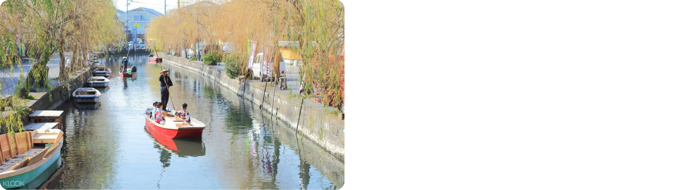
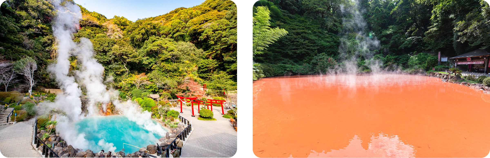
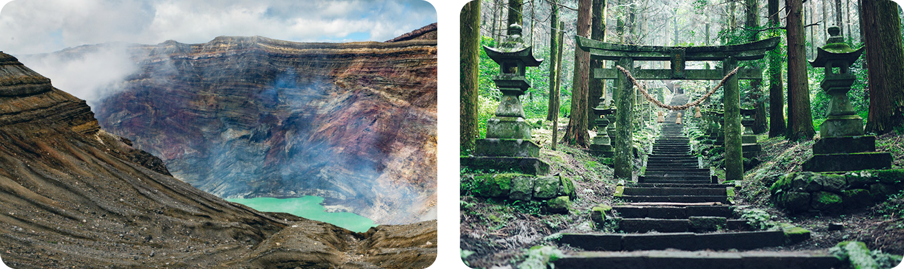

# 日本九州親子旅遊行程規劃

**旅遊日期：** 2025/2/10 - 2/16（7天6夜）
**成員：** 吳亭儀、陳思因、吳宣儀、吳燦東、劉秀蓮（五大人）、吳宇在、吳宇若（兩小孩 1Y10M）

---
# Day 1（2/10）：抵達福岡

### 航班資訊

| 航班 | 起飛時間 | 抵達時間 | 飛行時間 |
|------|---------|---------|---------|
| AirAsia AK 1510 | 11:55 台北桃園 (TPE) | 15:15 福岡 (FUK) | 2小時20分 |

💡 **日本時間比台灣快 1 小時**，抵達福岡當地時間為 16:15

### 交通

| 路線 | 交通方式 | 時間 | 費用 |
|------|----------|------|------|
| 福岡機場 → 博多站 | 地鐵空港線 | 5分鐘 | ¥260 |

### 行程時間表

| 時間 | 活動 |
|------|------|
| 11:55 | 台北桃園機場起飛 |
| 16:15 | 抵達福岡機場（日本時間） |
| 16:15-17:00 | 入境、領行李 |
| 17:00-17:30 | 搭地鐵到博多站、飯店 check-in |
| 17:30-19:00 | 博多車站周邊輕鬆逛 |
| 19:00 | 博多拉麵晚餐 |

### 景點清單
- [ ] JR 博多城（AMU PLAZA）
- [ ] 博多阪急百貨
- [ ] 博多站屋台村（可提早體驗屋台文化）

### 晚餐推薦：博多拉麵
| 餐廳 | 位置 | 特色 |
|------|------|------|
| 一蘭拉麵 | 博多運河城或中洲店 | 經典豚骨拉麵 |
| 一風堂 | 大名本店 | 創始店 |
| 博多一幸舍 | 博多站 | 車站內方便 |

### 住宿資訊
**區域：** 福岡市區（博多站步行 5-10 分鐘）

| 項目 | 建議 |
|------|------|
| 推薦區域 | 博多站附近 |
| 必備設施 | 廚房、洗衣機 |
| 住宿天數 | 2 晚 |

---

# Day 2（2/11）：福岡輕鬆遊（二選一）

## 方案 A：柳川一日遊（較充實）

### 交通路線

| 段落 | 交通方式 | 時間 | 費用 |
|------|----------|------|------|
| 博多站 → 西鐵福岡（天神）站 | 地鐵 | 約5分鐘 | ¥210 |
| 西鐵福岡（天神）→ 柳川 | 西鐵天神大牟田線 | 約50分鐘 | ¥870 |

### 詳細行程時間表

| 時間 | 活動 | 費用/備註 |
|------|------|----------|
| 09:00 | 西鐵福岡（天神）站出發 | - |
| 10:00 | 抵達西鐵柳川站 | - |
| 10:30-11:40 | 柳川遊船（どんこ舟） | 大人 ¥1,650，小孩 ¥850 冬季有暖桌被爐（こたつ舟） |
| 12:00-13:00 | 午餐：柳川鰻魚飯 | 見下方餐廳推薦 |
| 13:30-16:00 | 柳川老街散步 | 見下方景點清單 |
| 16:30 | 搭西鐵回福岡 | - |
| 17:30 | 回到福岡 | - |

### 遊船推薦

**柳川遊船（どんこ舟）**

| 公司 | 特色 |
|------|------|
| 水郷柳川観光 | 傳統遊船 |
| 大東エンタープライズ | 專業導覽 |

### 午餐推薦：柳川鰻魚飯（せいろ蒸し）

| 餐廳 | 特色 |
|------|------|
| 元祖本吉屋 | 創業 300 年老店 |
| 若松屋 | 超人氣，可能需排隊 |
| 御花 | 柳川藩主別邸，環境優美 |

### 柳川老街景點清單

- [ ] 北原白秋生家・記念館（詩人故居，¥600）
- [ ] 並倉（紅磚倉庫）
- [ ] 柳川老街古物店、雜貨店
- [ ] 沖端水天宮（水邊神社）

---

## 方案 B：太宰府半日遊 + 福岡市區（輕鬆版）

**適合：** 想看景點但不想太累、想多點時間購物

### 交通路線

| 段落 | 交通方式 | 時間 | 費用 |
|------|----------|------|------|
| 博多站 → 西鐵福岡（天神）站 | 地鐵 | 約5分鐘 | ¥210 |
| 西鐵福岡（天神）→ 太宰府 | 西鐵太宰府線 | 約30分鐘 | ¥420 |

### 行程時間表

| 時間 | 活動 | 備註 |
|------|------|------|
| 09:30 | 西鐵福岡（天神）站出發 | - |
| 10:00 | 抵達太宰府站 | - |
| 10:00-10:30 | 太宰府天滿宮參拜 | 學問之神，免費參觀 |
| 10:30-11:30 | 太宰府參道逛街 | 梅枝餅、伴手禮 |
| 11:30-12:00 | 星巴克太宰府店 | 隈研吾設計，超美建築 |
| 12:00-13:00 | 午餐 | 太宰府當地料理 |
| 13:30 | 搭西鐵回天神 | - |
| 14:00-17:00 | 天神購物區 | PARCO、三越、大丸百貨 |
| 17:00-18:00 | 回飯店休息 | 小孩午睡 |
| 18:30 | 天神或中洲晚餐 | - |

**太宰府天滿宮**

---

# Day 3（2/12）：福岡 → 由布院

### 交通

| 路線 | 交通方式 | 時間 | 費用 |
|------|----------|------|------|
| 博多 → 由布院 | JR 特急ゆふいんの森 或 ゆふ | 約 2 小時 10 分 | ¥3,160 |

💡 **建議搭乘：** 09:24 博多發「ゆふいんの森 1 號」（觀光列車，需預約）

### 行程時間表

| 時間 | 活動 | 備註 |
|------|------|------|
| 09:24 | 博多站出發 | JR 特急ゆふいんの森 |
| 11:35 | 抵達由布院站 | - |
| 11:45 | 由布院站租車 | 見下方租車資訊 |
| 12:00 | 開車到飯店 check-in（5 分鐘） | - |
| 12:30-13:30 | 午餐 | 由布院當地餐廳 |
| 14:00-17:00 | 下午活動（二選一） | 見下方選項 |
| 18:00 | 飯店晚餐、泡溫泉 | - |

### 租車資訊

| 項目 | 詳細 |
|------|------|
| **租車公司** | Toyota Rent a Car / Times / Nissan |
| **取車地點** | 由布院站附近 |
| **車型** | 8 人座（Toyota Noah、Voxy 或 Alphard） |
| **必備加租** | ✅ 嬰兒座椅 x2 ✅ 雪胎（冬季必備） |
| **租車期間** | Day 3-5（3天） |

### 下午活動選項

| 選項 | 活動內容 | 適合對象 |
|------|----------|----------|
| **A - 輕鬆版** | 飯店休息、泡湯 | 想放鬆的家庭 |
| **B - 散步版** | 由布院溫泉街散步、金鱗湖 | 想輕鬆逛街 |

💡 **由於住在溫泉街中心，隨時都能出去逛，不用急！**

#### 住宿資訊
**由布院溫泉（4 晚，同一間飯店）**

| 項目 | 詳細 |
|------|------|
| **住宿地址** | 1984-151 Yufuinchō Kawakami, Yufu, Oita 879-5102 |
| **位置優勢** | ✅ 溫泉街中心 ✅ 步行到湯之坪街道 5-10分鐘 ✅ 步行到金鱗湖 15分鐘 |
| **必備設施** | ✅ 停車場 |
| **住宿天數** | 4 晚（Day 3-6） |

---

# Day 4（2/13）：別府地獄溫泉一日遊

### 交通資訊

| 路線 | 交通方式 | 距離 | 車程 |
|------|----------|------|------|
| 由布院 → 別府（鐵輪） | 開車（県道11号 → 県道52号） | 約 25 公里 | 約 35-40 分鐘 |

### 行程時間表

| 時間 | 活動 | 備註 |
|------|------|------|
| 08:30 | 從由布院飯店出發 | 開車 |
| 09:15 | 抵達別府鐵輪地獄溫泉區 | - |
| 09:30-12:30 | 別府地獄溫泉巡禮 | 開車移動於各地獄間 |
| 12:30-13:30 | 午餐 | 別府當地料理 |
| 14:00-15:30 | 下午活動（三選一） | 見下方選項 |
| 16:00 | 開車回由布院 | 約 40 分鐘 |
| 16:40 | 抵達由布院 | - |
| 17:00-18:00 | 由布院溫泉街散步或飯店休息 | - |
| 18:00 | 飯店晚餐、泡溫泉 | - |

### 別府地獄溫泉巡禮

**門票選擇：**

| 方案 | 內容 | 費用 | 適合對象 |
|------|------|------|----------|
| **推薦方案** | 3-4 個地獄 | ¥1,800 | 帶小孩，不想太累 |
| 通票方案 | 7 個地獄通票 | ¥2,200 | 想多看幾個 |

**推薦組合（3-4個，共 ¥1,800）：**

**海地獄**

- [ ] ¥450 - 鈷藍色，最美，必看

**かまど地獄**
- [ ] ¥450 - 灶地獄，6 種地獄一次看，CP 值超高

**血池地獄 + 龍捲地獄**

- [ ] ¥900 組合票 - 紅色地獄 + 間歇泉，兩個在一起

**所有地獄清單（供參考）：**

| # | 地獄名稱 | 特色 | 推薦度 | 單獨門票 |
|---|----------|------|--------|----------|
| 1 | 海地獄 | 鈷藍色，最美 | ⭐⭐⭐⭐⭐ | ¥450 |
| 2 | 鬼石坊主地獄 | 灰色泥漿 | ⭐⭐⭐⭐ | ¥450 |
| 3 | 山地獄 | 河馬、紅鶴 | ⭐⭐⭐⭐ | ¥450 |
| 4 | かまど地獄 | 灶地獄，6 種地獄 | ⭐⭐⭐⭐⭐ | ¥450 |
| 5 | 鬼山地獄 | 鱷魚地獄 | ⭐⭐⭐ | ¥450 |
| 6 | 白池地獄 | 青白色 | ⭐⭐⭐ | ¥450 |
| 7 | 血池地獄 | 紅色 | ⭐⭐⭐⭐ | 組合票 ¥900 |
| 8 | 龍捲地獄 | 間歇泉，每 30-40 分鐘噴發 | ⭐⭐⭐⭐ | 組合票 ¥900 |

### 午餐推薦：別府當地料理

| 餐廳 | 特色 | 推薦菜色 |
|------|------|----------|
| とよ常本店 | 新鮮海鮮 | 關サバ、關アジ |
| 地獄蒸し工房 鉄輪 | 用地獄蒸氣蒸食物 | 地獄蒸し定食 |
| 甘味茶屋 | 溫泉甜點 | 地獄蒸しプリン（溫泉布丁） |

### 下午活動選項

| 選項 | 活動內容 | 費用 | 適合對象 |
|------|----------|------|----------|
| **A** | 別府纜車（別府ロープウェイ） | ¥1,600 | 想看風景 |
| **B** | 鐵輪溫泉街散步 | 免費 | 想體驗溫泉街氛圍 |
| **C** | 早點回由布院 | - | 想讓小孩午睡、回飯店休息 |

**選項 A 詳細：別府纜車**
- ✅ 到鶴見岳山頂
- ✅ 冬天山頂可能有雪
- ✅ 360° 全景，可看別府灣、四國

**選項 B 詳細：鐵輪溫泉街**
- ✅ 很有氛圍的老溫泉街
- ✅ 地獄蒸氣從路面冒出
- ✅ 蒸氣展望台、熱之湯（足湯）

---

### Day 5（2/14）：阿蘇火山一日遊

#### 路線資訊

| 項目 | 詳細 |
|------|------|
| **路線** | 由布院 → やまなみハイウェイ（九州橫斷公路）→ 阿蘇 |
| **距離** | 約 60 公里 |
| **車程** | 單程 1-1.5 小時 |

### 詳細時間表

| 時間 | 地點/活動 | 費用 | 備註 |
|------|----------|------|------|
| 08:00 | 由布院飯店出發 | - | 帶便當或飯糰 |
| 08:20-08:40 | 長者原休息站 | - | やまなみハイウェイ中點，風景很美 |
| 09:00-09:30 | 抵達阿蘇 | - | - |
| 09:30-11:00 | 阿蘇火山口 | 停車 ¥500 門票 ¥500 | ⚠️ 山上很冷，要穿暖 |
| 11:00-11:30 | 草千里 | - | 廣闊草原，拍照絕美 |
| 11:30-12:30 | 午餐：阿蘇赤牛料理 | - | 見下方餐廳推薦 |
| 12:30-14:00 | 阿蘇神社 | - | 參拜、參道商店街 |
| 14:30 | 開始回程 | - | - |
| 16:00 | 回到由布院 | - | - |
| 16:30-18:00 | 由布院溫泉街散步或飯店休息 | - | - |
| 18:00 | 飯店泡溫泉、晚餐 | - | - |

### 阿蘇火山口資訊

| 項目 | 詳細 |
|------|------|
| **正式名稱** | 阿蘇中岳火山口 |
| **停車場** | 阿蘇山上廣場駐車場（¥500） |
| **門票** | ¥500（火山活動狀況允許才開放） |
| **交通方式** | 可搭纜車或走上去（約 10 分鐘） |
| **Google Maps** | [阿蘇火山口停車場](https://maps.app.goo.gl/99hAHctbbYdUriiY6) |

⚠️ **重要提醒：**
- 行前確認開放狀況：[阿蘇火山防災協議會](http://www.aso.ne.jp/~volcano/)
- **山上很冷，務必穿暖！**
  - 2月山上溫度：約 **-5°C 到 5°C**
  - 加上風寒效應會更冷
  - 建議穿著：羽絨外套、毛帽、手套、圍巾
  - 很可能有雪，注意防滑

**阿蘇中岳火山口**

📍 **Google Maps：** [阿蘇火山口停車場](https://maps.app.goo.gl/99hAHctbbYdUriiY6)

**草千里**

📍 **Google Maps：** [阿蘇草千里之濱](https://maps.app.goo.gl/YrJwnDWvW1av2vdEA)

✅ **特色：**
- 就在火山口附近，開車 5 分鐘
- 廣闊草原，可能有雪
- 小孩可以跑跳
- 拍照絕美

####午餐推薦：阿蘇赤牛料理

| 餐廳 | 特色 | 推薦菜色 | 備註 |
|------|------|----------|------|
| いまきん食堂 | 超人氣 | 赤牛丼 | 可能要排隊 |
| あか牛の館 | 景觀餐廳 | 赤牛定食 | 草千里旁 |
| レストラン北山 | 高級餐廳 | 赤牛ステーキ | 價位較高 |

### 下午景點：阿蘇神社

**阿蘇神社**

✅ **特色：**
- 日本重要神社，2016 年地震後重建
- 參道有商店街，可以逛逛
- 停留時間：1-1.5小時

### ⚠️ 注意事項

| 項目 | 說明 |
|------|------|
| **雪胎** | 冬季山路可能有雪，務必租雪胎 |
| **天氣** | 行前查天氣和路況：[日本道路交通情報](https://www.jartic.or.jp/) |
| **備案** | 如果路況不佳，彈性取消改在別府玩 |

---

# Day 6（2/15）：由布院悠閒一日遊

💡 **優勢：住在由布院，這天完全不需要開車，步行即可玩遍！**

### 行程時間表

| 時間 | 地點/活動 | 備註 |
|------|----------|------|
| 早上自由安排 | 飯店睡到自然醒 | 前幾天都早起，今天放鬆 |
| 09:00-10:00 | 金鱗湖晨間散步 | 從飯店步行 15 分鐘 |
| 10:00-10:30 | 回飯店或咖啡廳休息 | - |
| 10:30-13:00 | 湯之坪街道逛街購物 | 從飯店步行 5-10 分鐘 |
| 13:00-14:00 | 午餐 | 由布院特色餐廳 |
| 14:00-15:00 | **開車到由布院站還車** | 從飯店 5 分鐘車程 |
| 15:00-18:00 | 車站周邊逛逛或步行回飯店休息、泡溫泉 | 步行回飯店約 20 分鐘 |
| 18:00 | 飯店晚餐 | 最後一晚溫泉 |

### 金鱗湖

**金鱗湖**

✅ **特色：**
- 早上霧氣最美
- 湖邊散步、拍照
- 從飯店步行 15 分鐘

### 湯之坪街

| 店家 | 類型 | 備註 |
|------|------|------|
| B-speak | 蛋糕店 | 蛋糕捲，記得早點去！ |
| Yufuin Floral Village | 歐風小村 | 拍照好看 |
| Snoopy 茶屋 | 主題咖啡廳 | 小孩會喜歡 |
| Donguri no Mori | 宮崎駿專賣店 | 龍貓周邊 |
| 由布院駅舎温泉 | 足湯 | 車站旁，免費 |
| 古物店、雜貨店 | 特色小店 | 可慢慢逛 |

### 午餐推薦：由布院特色餐廳

| 餐廳 | 特色 | 推薦菜色 |
|------|------|----------|
| 由布まぶし心 | 鰻魚飯專門店 | 鰻魚飯三吃 |
| 茶房 天井棧敷 | 隱密咖啡廳 | 午間套餐 |
| Bistro Shou | 景觀餐廳 | 洋食套餐 |

### 還車資訊

| 項目 | 詳細 |
|------|------|
| **還車時間** | 14:00-15:00 |
| **還車地點** | 由布院站 |
| **租車公司** | Toyota Rent a Car 由布院站前店 |

💡 **從飯店開車到由布院站約 5 分鐘，步行回飯店約 20 分鐘**

**附註：如果想延長租車（Day 6 也租）**
- 可以選擇開車到**塚原高原**（20 分鐘車程）
  - 開闊草原風景
  - 塚原溫泉（酸性泉，很特別）
  - 適合拍照
- 晚上 18:00-19:00 還車
- 租車費用會增加約 NT$ 1,650-2,300

---

# Day 7（2/16）：由布院 → 博多站 → 福岡機場 → 台北

### 航班資訊

| 航班 | 起飛時間 | 抵達時間 | 飛行時間 |
|------|---------|---------|---------|
| AirAsia AK 1511 | 16:55 福岡 (FUK) | 18:30 台北桃園 (TPE) | 2小時35分 |

💡 **台灣時間比日本慢 1 小時**，抵達台北當地時間為 17:30

### 交通
- 由布院 → 博多：JR 特急ゆふいんの森 或 ゆふ，約 2 小時 10 分，¥3,160
- 博多 → 福岡機場：地鐵空港線，5 分鐘，¥260

### 詳細時間表
- **08:00** 飯店早餐
- **08:30** 退房、步行到由布院站（20 分鐘）
- **09:30** 由布院站搭 JR 特急出發
  - 建議班次：09:30「ゆふ 6 號」
- **11:42** 抵達博多站
- **11:42-14:00** 博多站採買、午餐（2 小時充裕）

### 伴手禮推薦
**博多駅マイング（MING）（車站地下街）**
- 福太郎（明太子）
- 博多通りもん（銘菓）
- めんべい（仙貝）

**博多阪急百貨 B1**
- 各種福岡銘菓
- 明太子專賣區

**デイトス（DEITOS）（車站內）**
- 一蘭泡麵
- 一風堂泡麵

### 午餐推薦
- 博多駅ラーメン街（拉麵一條街，10 樓）
- 博多阪急餐廳樓層（11-13 樓）
- つきひ（站內和食）

### 返程
- **14:00** 搭地鐵到福岡機場
- **14:10** 抵達國際航廈
- **14:10-16:00** 辦理登機、托運行李、逛免稅店
- **16:55** 福岡機場起飞
- **17:30**（台灣時間）抵達台北桃園機場

---

### 住宿總結
- **福岡市區：** 2 晚（博多站附近）
- **由布院溫泉：** 4 晚（同一間飯店）
  - 地址：1984-151 Yufuinchō Kawakami, Yufu, Oita 879-5102
  - 位置優勢：溫泉街中心，步行到湯之坪街道 5-10 分鐘

### 租車總結
- **租車期間：** Day 3-5（3 天）
- **取車：** Day 3 中午 11:45，由布院站
- **還車：** Day 6 下午 14:00-15:00，由布院站
- **車型：** 8 人座（Toyota Noah、Voxy、Alphard）
- **必備：** 嬰兒座椅 x2、雪胎（冬季）

#### 預估費用
- 租車 3 天：¥22,500-31,500（NT$ 4,950-6,900）
- 油費：¥4,500（NT$ 990）
- 過路費：¥2,500（NT$ 550）
- **總計：約 NT$ 6,490-8,440**

---

### 預算總結

#### 已確定費用（每位大人）
| 項目 | 每人費用 | 全團費用（5 大人 + 2 小孩） | 備註 |
|------|---------|---------------------------|------|
| **機票** | NT$ 18,000 | NT$ 93,600 | 大人 NT$ 18,000 x 5 + 嬰兒票 NT$ 1,800 x 2 |
| **住宿 6 晚** | - | NT$ 57,700 | 福岡 2 晚 NT$ 20,000 + 由布院 4 晚 NT$ 37,700 |
| **小計** | - | NT$ 151,300 | 機票 + 住宿 |

#### 預估其他費用（全團）
| 項目 | 金額 | 備註 |
|------|------|------|
| **租車 3 天** | NT$ 4,950-6,900 | 含嬰兒座椅 x2、雪胎 |
| **油費 + 過路費** | NT$ 1,540 | 估算 |
| **JR 交通費** | NT$ 6,930 | 博多 ↔ 由布院（5 大人，小孩免費） |
| **其他交通** | NT$ 5,000 | 地鐵、西鐵（Day 1-2） |
| **餐費** | NT$ 42,000 | 估算 6 天，5 大人 x 每天 NT$ 1,400 |
| **景點門票** | NT$ 6,500 | 地獄溫泉推薦組合 + 阿蘇火山（小孩半價或免費） |

#### 總預算（必要開銷）
- **機票 + 住宿**：NT$ 151,300
- **其他必要費用**：NT$ 66,920-68,870
- **全團總計**：約 NT$ 218,220-220,170
- **每位大人平均**：約 NT$ 43,600-44,000（含機票住宿及全部開銷分攤）

---

### 重要提醒

#### 出發前必辦事項
- ✅ **機票**：已訂！AirAsia 2/10-2/16
- ✅ **由布院住宿**：已訂！1984-151 Yufuinchō Kawakami（溫泉街中心）
- ⚠️ **小孩護照**：2 位小孩（1Y10M）都需要辦護照
  - 需準備：戶口名簿、照片 2 張、父母雙方身分證
  - 規費：NT$ 900/人（未滿 14 歲）
  - 工作天：5 個工作天
  - 效期：5 年
  - 💡 建議找有幫嬰幼兒拍證件照經驗的照相館
- ⚠️ **駕照譯本**：去監理站申請（NT$ 100）
  - 需本人攜帶：身分證、駕照、護照
- ⚠️ **租車**：提早訂，確認由布院站有取還車點
  - 記得加租：嬰兒座椅 x2、雪胎
- ⚠️ **JR 預約**：「ゆふいんの森」觀光列車建議提早預約（Day 3）
  - 可透過 JR 九州網站或到站後劃位

#### 出發前確認
- ⚠️ **阿蘇火山**：出發前確認開放狀況和天氣
  - 查詢網站：[阿蘇火山防災協議會](http://www.aso.ne.jp/~volcano/)
- ⚠️ **天氣**：查詢九州天氣預報
  - [日本氣象廳](https://www.jma.go.jp/)
  - [日本道路交通情報](https://www.jartic.or.jp/)
- ✅ **保持彈性**：天氣不好就調整行程

