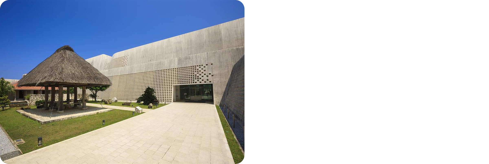
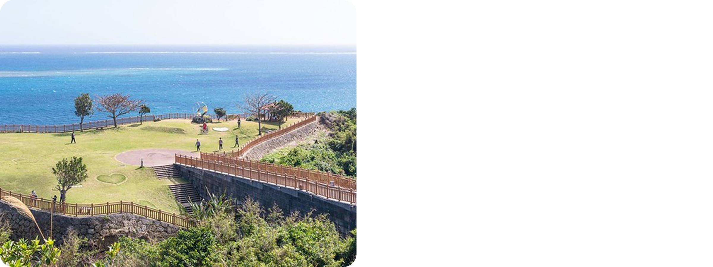
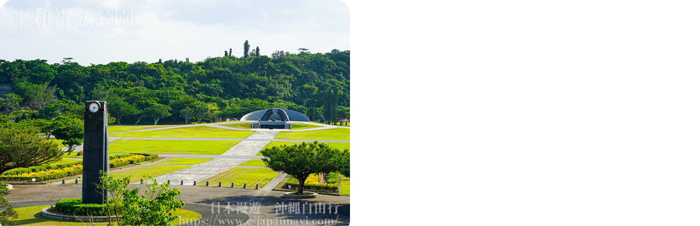

# 沖繩過年渡假旅遊 (2026/2/11-2/17)
> 成員：吳亭儀、陳思因（2大人）+ 吳宇若（1小孩 1Y10M）

---

> 備註：過年是 2/14 開始放假，我們要請假三天，2/11 看到早上從台東搭車到台北，還是前一晚搭車。

## 班機資訊

### 去程：台北桃園 → 沖繩那霸
- **航空公司**：泰國亞洲航空 (AirAsia)
- **日期**：2026年2月11日（二）
- **時間**：13:30 - 15:55
- **飛行時間**：1小時25分鐘
- **航班類型**：直飛

### 回程：沖繩那霸 → 台北桃園
- **航空公司**：泰國亞洲航空 (AirAsia)
- **日期**：2026年2月17日（一）
- **時間**：16:55 - 17:35
- **飛行時間**：1小時40分鐘
- **航班類型**：直飛

---

## Day 1 (2/11 二) - 抵達日

### 下午
- 15:55 抵達那霸機場
- 取車、安裝兒童座椅（約30-40分鐘）
- 前往恩納海邊度假屋（車程約50-60分鐘）

### 傍晚
- 抵達度假屋，休息、整理行李
- 附近晚餐或超市採買
- 推薦：恩納の駅（在地食材）、MaxValu（超市）

### 住宿
恩納海邊度假屋（Airbnb）

---

## Day 2 (2/12 三) - 那霸文化深度日

### 上午
- **沖繩縣立博物館・美術館** ⭐重點
  - 琉球王國歷史、沖繩戰役
  - 自然史、民俗文化展示
  - 停留時間：2-3小時
  - 設施：育嬰室、適合推車

  

### 下午
- **首里城公園** 🏯 世界文化遺產
  - 琉球王國政治中心
  - 守禮門、園比屋武御嶽石門
  - 停留時間：1.5-2小時
  - 注意：避開正中午

  

### 傍晚
- **金城町石疊道** - 古老石板路（時間允許）

### 住宿
恩納海邊度假屋（Airbnb）

---

## Day 3 (2/13 四) - 中南部歷史遺跡

### 上午
- **齋場御嶽** ⭐⭐⭐ 世界文化遺產 必訪！
  - 琉球王國最高聖地
  - 巨石形成的神聖空間
  - 可遠眺久高島
  - 注意：需事前線上預約（免費）、需走一小段路

  

### 中午
- **知念岬公園** - 齋場御嶽旁，海景絕美

  

### 下午
- **舊海軍司令部壕** - 太平洋戰爭遺跡
  - 地下坑道，震撼的歷史現場

  

- **和平祈念公園 + 和平祈念資料館**
  - 沖繩戰役完整資料
  - 紀念碑群面對大海
  - 外面草地可讓幼兒跑跳

  

### 住宿
恩納海邊度假屋（Airbnb）

---

## Day 4 (2/14 五) - 水族館日

### 上午
- 出發前往北部
- **今歸仁城跡** 🏯 世界文化遺產
  - 琉球三大城之一
  - 壯觀城牆遺跡
  - 2月可能有櫻花（寒緋櫻）
  - 停留時間：1小時

  

### 下午
- **美麗海水族館** ⭐⭐⭐ 重點！
  - 黑潮之海大水槽
  - 海豚秀
  - 觸摸池（幼兒最愛）
  - 停留時間：3-4小時

  

- **海洋博公園** - 大草地讓孩子放電

### 住宿
恩納海邊度假屋（Airbnb）

---

## Day 5 (2/15 六) - 中部文化體驗

### 上午
- **座喜味城跡** 🏯 世界文化遺產
  - 保存最完整的城牆
  - 人少清幽，可登高望遠
  - 停留時間：40分鐘

- **殘波岬** - 白色燈塔、斷崖絕壁

### 下午

先留空

### 住宿
恩納海邊度假屋（Airbnb）

---

## Day 6 (2/16 日) 

### 全日
- **勝連城跡** 🏯 世界文化遺產
  - 沖繩最古老的城跡之一
  - 360度全景視野
  - 停留時間：1小時

- **中城城跡** 🏯 世界文化遺產
  - 保存最完整的城跡
  - 石牆建築技術精湛
  - 停留時間：1-1.5小時

- **沖繩兒童王國** - 動物園+兒童博物館
  - 讓孩子放電的好地方

### 住宿
恩納海邊度假屋（Airbnb）

---

## Day 7 (2/17 一) - 離境

### 上午
- **壺屋燒物博物館**（那霸）- 沖繩陶器歷史
- **壺屋通** - 陶器老街，買紀念品
- 或 **福州園** - 中式庭園

### 中午
- **瀨長島 Umikaji Terrace** - 機場旁最後看海、午餐

### 下午
- 還車、前往機場
- 16:55 起飛返台

---

## 世界文化遺產清單

### 本次行程涵蓋（共7處）
- ✅ 首里城（周邊建築）
- ✅ 識名園（時間允許）
- ✅ 齋場御嶽 ⭐最推薦
- ✅ 今歸仁城跡
- ✅ 座喜味城跡
- ✅ 勝連城跡
- ✅ 中城城跡

### 其他未排入
- 玉陵、園比屋武御嶽石門

---

## 實用資訊

### 重要提醒
- ⚠️ 週一多數博物館休館，請確認開館時間
- ⚠️ 首里城、城跡約16:30後關閉
- ⚠️ 齋場御嶽需事前線上預約（免費）
- 📱 建議下載：Google Maps、沖繩觀光APP

### 交通
- 🚗 租車必備（含兒童安全座椅）
- 🅿️ 各景點多有免費停車場
- ⛽ 加油站密集，不用擔心

### 住宿資訊
- **全程住宿**：恩納海邊度假屋（Airbnb）
  - 📍 位置：恩納村海邊
  - ✅ 優勢：有廚房可自炊、適合親子、有洗衣機
  - 🚗 位於沖繩中部，往南往北都方便
  - 🏖️ 海邊度假氛圍，孩子可玩沙玩水
  - 每日開車時間詳見下方

### 全程住恩納村 - 每日開車時間估算

| 日期 | 主要景點 | 單程距離 | 單程時間 | 當日總車程 |
|------|---------|---------|---------|-----------|
| **2/11** | 機場→波上宮→國際通→恩納 | 70km | 50-60分 | **約1.5小時** |
| **2/12** | 恩納→縣立博物館→首里城→恩納 | 40km | 50分 | **約2小時** |
| **2/13** | 恩納→齋場御嶽→和平公園→恩納 | 50km | 1小時 | **約2.5小時** |
| **2/14** | 恩納→今歸仁城→美麗海→恩納 | 45km | 1小時 | **約2小時** |
| **2/15** | 恩納→座喜味城→美國村→恩納 | 15km | 20分 | **約1小時** |
| **2/16** | 恩納→勝連城→中城城→恩納 | 30km | 40分 | **約1.5小時** |
| **2/17** | 恩納→壺屋通→瀨長島→機場 | 50km | 1小時 | **約1.5小時** |

**開車時間分析：**
- ✅ **最輕鬆**：Day 15 (約1小時) - 都在附近
- ✅ **可接受**：Day 11, 14, 16, 17 (1.5-2小時) - 正常範圍
- ⚠️ **較長**：Day 12, 13 (2-2.5小時) - 需注意孩子狀況

**優點：**
- 完全不用換飯店、整理行李
- 可選擇有海灘的度假村，每天回去都能玩水
- 恩納村餐廳、便利商店充足

**缺點：**
- Day 2, 3 往那霸/南部單程約 50 分鐘
- 需早點出門避開塞車

**建議事項：**
- Airbnb 有廚房，可準備幼兒餐點、早餐
- 利用車上時間讓孩子睡午覺
- Day 2, 3 可早點出發或調整順序
- 附近超市：恩納の駅、MaxValu（採買食材用）

### 帶幼兒注意事項
- 👶 城跡需走路：帶輕便推車+揹巾
- 😴 每天安排1-1.5小時午休
- 🚼 博物館、資料館都有育嬰室
- 🍼 便利商店(全家、羅森)有嬰幼兒用品
- 🌡️ 2月氣溫15-20°C，備薄外套

### 彈性調整原則
- ✅ 幼兒狀況好：可加入更多景點
- ✅ 幼兒累了：刪減行程，去海灘/公園放風
- ✅ 行程以大人為主，但保留彈性最重要

### 餐廳推薦
- **首里城附近**：首里そば（沖繩麵）
- **那霸市區**：第一牧志公設市場（海鮮）
- **各景點**：多有家庭餐廳（有兒童椅）
- **便利選擇**：全家、羅森便利商店

### 2月氣候
- 🌡️ 氣溫：15-20°C
- 🧥 服裝：長袖+薄外套
- ☀️ 紫外線仍強，需防曬
- 🌸 可能看到寒緋櫻（今歸仁城跡）

### 預算總覽

| 項目 | 費用 | 備註 |
|------|------|------|
| **機票** | NT$30,000 | NT$15,000 × 2大人（嬰兒免費） |
| **住宿** | NT$17,257 | 恩納海邊度假屋（5晚，2/11-2/16） |
| **租車** | NT$7,000 | 含兒童安全座椅，7天 |
| **油資** | NT$2,000 | 預估 |
| **景點門票** | NT$1,935 | 詳見下方明細 |
| **餐費+超市** | NT$10,000 | 可自炊節省 |
| **總計** | **NT$68,192** | 不含個人購物 |
| **平均每人** | **NT$34,096** | 68,192 ÷ 2 大人 |

### 景點門票明細

| 景點 | 成人票價 | 兒童票價 | 2大人費用 | 備註 |
|------|---------|---------|---------|------|
| 沖繩縣立博物館 | ¥530 | 免費 | ¥1,060 | 約NT$230 |
| 首里城公園 | ¥400 | 免費 | ¥800 | 約NT$175 |
| 齋場御嶽 | 免費 | 免費 | ¥0 | 需預約 |
| 舊海軍司令部壕 | ¥440 | 免費 | ¥880 | 約NT$190 |
| 和平祈念資料館 | ¥300 | 免費 | ¥600 | 約NT$130 |
| 今歸仁城跡 | ¥600 | 免費 | ¥1,200 | 約NT$260 |
| 美麗海水族館 | ¥2,180 | 免費 | ¥4,360 | 約NT$950 |
| **門票總計** | - | - | **¥8,900** | **約NT$1,935** |

### 省錢建議
- ✅ Airbnb 有廚房，可自炊早餐和部分晚餐
- ✅ 超市採買：MaxValu、恩納の駅
- ✅ 多數景點免費或門票便宜
- ✅ 1Y10M 幼兒所有門票免費
- ✅ 自駕免搭計程車

### 匯率參考
- 1 JPY ≈ 0.217 TWD（實際匯率請以當日為準）

---

## 每日重點

| 日期 | 主題 | 必訪景點 |
|------|------|----------|
| 2/11 | 抵達日 | 波上宮、國際通 |
| 2/12 | 那霸文化 | 縣立博物館、首里城 ⭐ |
| 2/13 | 南部歷史 | 齋場御嶽、和平公園 ⭐⭐⭐ |
| 2/14 | 水族館日 | 今歸仁城、美麗海水族館 ⭐⭐⭐ |
| 2/15 | 中部文化 | 座喜味城、琉球村/美國村 |
| 2/16 | 彈性日 | 勝連城、中城城、兒童王國 |
| 2/17 | 離境 | 壺屋通、瀨長島 |

---

## 打包清單

### 證件類
- [ ] 護照
- [ ] 台胞證（如需）
- [ ] 駕照（國際駕照或日文譯本）
- [ ] 信用卡、現金

### 幼兒用品
- [ ] 奶粉、奶瓶
- [ ] 尿布、濕紙巾
- [ ] 常用藥品（退燒、腹瀉藥）
- [ ] 防曬乳、防蚊液
- [ ] 換洗衣物、外套
- [ ] 推車、揹巾
- [ ] 玩具、繪本

### 其他
- [ ] 相機、充電器
- [ ] 防水袋
- [ ] 環保袋
- [ ] 旅遊保險