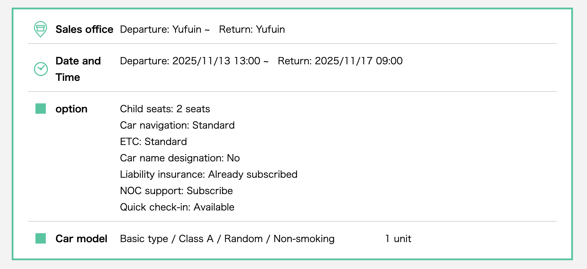
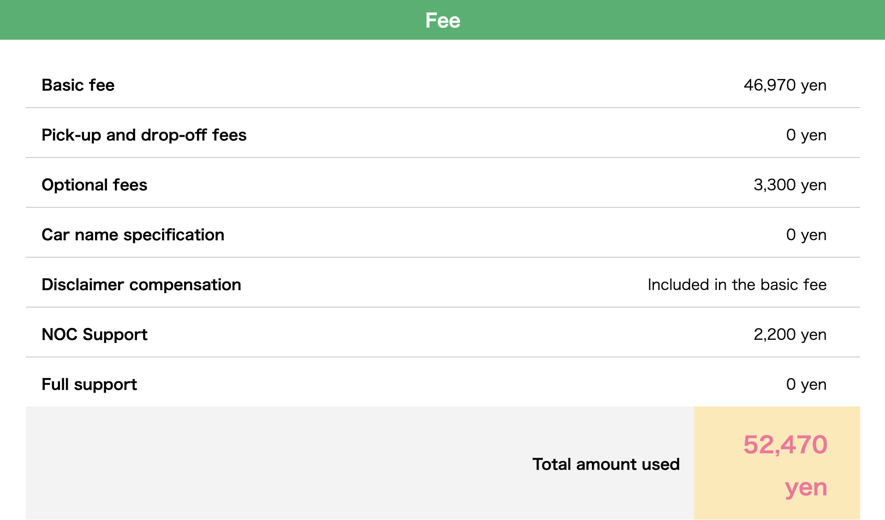

# 九州租車資訊

## 租車基本資料

**租車期間：** Day 4-8（2/13-2/17，約 3.5 天）

| 項目 | 詳細 |
|------|------|
| **取車時間** | Day 4（2/13）13:00 |
| **取車地點** | 由布院站 |
| **還車時間** | Day 8（2/17）09:00 |
| **還車地點** | 由布院站 |
| **租車天數** | 約 3.5 天 |
| **車型需求** | 5 人座（Toyota Corolla Cross 或同級，3 大人 + 2 小孩） |
| **必備設施** | 嬰兒座椅 x2（2 位小孩 1Y10M 使用） |
| **座位安排** | 後座：大人（中間）+ 嬰兒座椅 x2 |

---

## 由布院站租車公司（由布院駅 レンタカー）

### 1. JR 駅レンタカー（JR Station Rent-a-Car）由布院駅営業所 ⭐ 推薦

| 項目 | 詳細 |
|------|------|
| **位置** | 由布院駅出口左手駅前停車場內（最近！） |
| **地址** | 大分県由布市湯布院町川上8 |
| **電話** | 0977-84-5559 |
| **營業時間** | 09:00-18:00（全年無休） |
| **官網** | [JR駅レンタカー](https://www.ekiren.co.jp/office/detail/K04408) |
| **特色** | ✅ 就在車站旁 ✅ 可線上預約 |

### 2. 日産レンタカー（Nissan Rent a Car）湯布院店

| 項目 | 詳細 |
|------|------|
| **位置** | 由布院駅徒步 3 分鐘，ホテルことぶき花の荘手前 |
| **地址** | 大分県由布市湯布院町川上3729-1 |
| **官網** | [Nissan Rent-a-Car](https://nissan-rentacar.com/en/shops/3P4N3) |

### 3. バジェットレンタカー（Budget Rental Car）

| 項目 | 詳細 |
|------|------|
| **位置** | 由布院駅徒步 5 分鐘，コスモスタンド内 |

---

## 備案

⚠️ **如果由布院站沒有車**

建議換到別府市區或福岡市區的住宿，選擇租車點更多、交通更方便的地點。由布院站租車選擇較少，若無法預訂成功，調整住宿地點會比從別府站取還車更便利。

---

## 預估費用

| 項目 | 費用 |
|------|------|
| **租車 3.5 天（5人座）** | ¥35,000-45,000（NT$ 7,700-9,900） |
| **嬰兒座椅 x2** | 含在租車費用中或額外付費 |
| **油費** | ¥4,500（NT$ 990） |
| **過路費** | ¥0（都是一般道路） |
| **雪胎（視需要）** | 詢問能否臨時加購 |
| **總計** | 約 ¥39,500-49,500（NT$ 8,690-10,890） |

💡 **匯率參考：** 1 JPY ≈ 0.22 TWD

---

## 實際報價參考（JR 駅レンタカー）

⚠️ **以下為 2025/11/13-17 的參考報價，實際 2026/2 月價格待開放預訂後確認**

**預訂詳情：**
- 取車：Yufuin 13:00
- 還車：Yufuin 09:00
- 嬰兒座椅：2 seats
- 車型：Basic type / Class A / Random / Non-smoking（5人座）
- 已包含：車載導航、ETC、責任保險
- NOC Support（營業損失補償）：已加購

**費用明細：**
- Basic fee：¥46,970
- Optional fees：¥3,300（嬰兒座椅 x2）
- NOC Support：¥2,200
- **總計：¥52,470**

✅ **此價格在可接受範圍內（稍高約 ¥3,000，約 NT$ 660）**

💡 **待辦事項：**
- [ ] 2026/2 月開放預訂後盡快預約（約 2025/11 月開放）
- [ ] 預約時確認是否需要加購雪胎（視天氣決定）
- [ ] 記得油費另計（預估 ¥4,500）

---

## 注意事項

### 出發前必辦
- ⚠️ **駕照日文譯本**：去監理站申請（NT$ 100）
  - 需本人攜帶：身分證、駕照、護照

### 租車時確認
- ✅ 嬰兒座椅 x2（1Y10M 小孩適用）
- ✅ 雪胎（視天氣決定，詢問能否臨時加購）
- ✅ 車輛保險（建議加保全險）
- ✅ 緊急聯絡電話

### 取車當天需攜帶
1. 台灣駕照正本
2. 駕照日文譯本
3. 護照
4. 信用卡（押金）

---

## 行程規劃

### Day 4（2/13）取車
- 13:00 由布院站取車
- 開車前往民宿 check-in、放行李（開車 5 分鐘）
- 午餐：由布院當地餐廳
- 下午：民宿休息或由布院溫泉街散步

### Day 5（2/14）使用租車
- 由布院民宿 → 九州自然動物公園（約 30-35 分鐘車程，22 公里）
- 九州自然動物公園一日遊（野生動物區巴士、互動動物區）
- 九州自然動物公園 → 由布院民宿

### Day 6（2/15）使用租車
- 由布院民宿 → 別府鐵輪地獄溫泉區（約 35-40 分鐘車程，25 公里）
- 別府地獄溫泉巡禮（海地獄、かまど地獄、血池地獄、龍捲地獄）
- 別府 → 由布院民宿

### Day 7（2/16）使用租車
- 開車前往金鱗湖晨間散步
- 開車前往湯之坪街道逛街購物
- 開車回民宿休息、泡溫泉

### Day 8（2/17）還車
- 09:00 由布院站還車
- 09:24 搭 JR 特急「ゆふ 6 號」返回博多

**總行程距離：** 約 94 公里（Day 5-6 主要行程）+ 由布院市區短程移動
